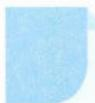

# 7 分析法

引路人 浙江省绍兴鲁迅中学 刘美良

本思想方法涉及模块: 函数、导数、数列、不等式、三角、立体几何等.

![[高中/思维方法/高中数学思想方法导引2023版/07_分析法/方法介绍/方法介绍.md]]
![[高中/思维方法/高中数学思想方法导引2023版/07_分析法/典例示范/典例示范.md]]
![[高中/思维方法/高中数学思想方法导引2023版/07_分析法/巩固练习/巩固练习.md]]
