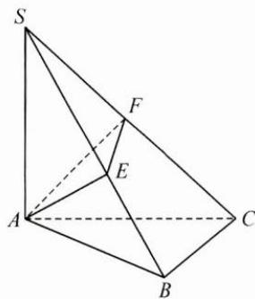

## 典例示范

例1 已知 $a > 0$ ，求证： $\sqrt{a^2 + \frac{1}{a^2}} -\sqrt{2}\geqslant a + \frac{1}{a} -2.$

思路 作差比较法是证明代数不等式的常用方法,注意到不等式左边是含a的无理根式,直接作差所得的代数式符号判断比较困难,于是寻找目标不等式成立的充分条件,即只需证 $\sqrt{a^{2}+\frac{1}{a^{2}}+2\geqslant a+\frac{1}{a}+\sqrt{2}}$ 成立.

证明 要证 $\sqrt{a^2 + \frac{1}{a^2}} - \sqrt{2} \geqslant a + \frac{1}{a} - 2$ ，只需证 $\sqrt{a^2 + \frac{1}{a^2}} + 2 \geqslant a + \frac{1}{a} + \sqrt{2}$ ，

因为 $a > 0$ ，故只需证 $\left(\sqrt{a^2 + \frac{1}{a^2}} + 2\right)^2 \geqslant \left(a + \frac{1}{a} + \sqrt{2}\right)^2,$

即 $a^2 + \frac{1}{a^2} + 4\sqrt{a^2 + \frac{1}{a^2}} + 4 \geqslant a^2 + 2 + \frac{1}{a^2} + 2\sqrt{2}\left(a + \frac{1}{a}\right) + 2,$

从而只需证 $2\sqrt{a^2 + \frac{1}{a^2}} \geqslant \sqrt{2}\left(a + \frac{1}{a}\right)$ ,

即证 $4\left(a^{2} + \frac{1}{a^{2}}\right)\geqslant 2\left(a^{2} + 2 + \frac{1}{a^{2}}\right)$ ，即证 $a^2 +\frac{1}{a^2}\geqslant 2$

而上述不等式显然成立，故原不等式成立.

反思 对于含无理根式的不等式证明, 当直接运用比较法证明比较困难时, 常运用分析法证明原不等式, 其中将待证的不等式两边平方是把无理式转化为有理式的常用方法.

例 2 如图, $SA \perp$ 平面 $ABC$ , $AB \perp BC$ , 过点 $A$ 作 $SB$ 的垂线, 垂足为 $E$ , 过点 $E$ 作 $SC$ 的垂线, 垂足为 $F$ , 求证: $AF \perp SC$ .

思路 要证明空间两直线垂直,常转化为证明线面垂直,于是要证 $AF \perp SC$ , 只需证 $SC \perp$ 平面 AEF, 故只需证 $SC \perp AE$ , 从而只需证 $AE \perp$ 平面 SBC.

证明 要证 $AF \perp SC$ ，只需证 $SC \perp$ 平面 $AEF$ ，而 $SC \perp EF, EF \cap AE = E$

故只需证 $SC \perp AE$

只需证 $AE \perp$ 平面 SBC，

而 $AE \perp SB, SB \cap BC = B,$

故只需证 $AE \perp BC$ ,

只需证 $BC \perp$ 平面 SAB，而 $BC \perp AB, AB \cap SA = A$ ，

故只需证 $BC \perp SA$ ，由题意知 $SA \perp$ 平面 ABC，

故 $BC \perp SA$ 显然成立, 所以 $AF \perp SC$ .

反思 证明空间两直线垂直,关键是寻找其成立的充分条件,即证其中一条直线垂直于另一条直线所在的平面.

例3 已知数列 $\{a_{n}\}$ 满足: $a_{n+2} = 3a_{n+1} - 2a_{n}, a_{1} = 1, a_{2} = 3$ . 记 $b_{n} = \frac{\sqrt{3n+1}}{a_{n+1} + 1}, S_{n}$ 为数列 $\{b_{n}\}$ 的前 $n$ 项和, 求证: $S_{n} \leqslant \frac{\sqrt{7}}{2} - \frac{\sqrt{3n+7}}{2^{n+1}}$ .

思路 先运用已知条件得到 $b_n = \frac{\sqrt{3n + 1}}{2^{n + 1}}$ . 考虑到直接求数列 $\{b_n\}$ 的前 $n$ 项和 $S_n$ 比较困难, 于是将要证的目标式 $S_n \leqslant \frac{\sqrt{7}}{2} - \frac{\sqrt{3n + 7}}{2^{n + 1}}$ 视为 $S_n \leqslant \frac{\sqrt{7}}{2} - \frac{\sqrt{3n + 7}}{2^{n + 1}} = D_n = d_1 + d_2 + \cdots + d_n$ , 转化为证明 $b_n = \frac{\sqrt{3n + 1}}{2^{n + 1}} \leqslant d_n = \frac{\sqrt{3n + 4}}{2^n} - \frac{\sqrt{3n + 7}}{2^{n + 1}}$ , 从而运用分析法证明. 证明 由 $a_{n+2} = 3a_{n+1} - 2a_n$ , 得 $a_{n+2} - a_{n+1} = 2(a_{n+1} - a_n)$ , 故数列 $\{a_{n+1} - a_n\}$ 为等比数列, 又 $a_2 - a_1 = 2$ , 则 $a_{n+1} - a_n = 2^n$ , 所以 $a_n = a_1 + (a_2 - a_1) + (a_3 - a_2) + \cdots + (a_n - a_{n-1}) = 2^n - 1$ . 考虑到待证式的右边是一个含 $n$ 的代数式, 记 $D_n = \frac{\sqrt{7}}{2} - \frac{\sqrt{3n + 7}}{2^{n + 1}}$ , 令其为数列 $\{d_n\}$ 的前 $n$ 项和, 可得 $d_n = D_n - D_{n-1} = \frac{\sqrt{3n + 4}}{2^n} - \frac{\sqrt{3n + 7}}{2^{n + 1}}$ . 故欲证 $S_n \leqslant \frac{\sqrt{7}}{2} - \frac{\sqrt{3n + 7}}{2^{n + 1}}$ , 只要证 $b_n = \frac{\sqrt{3n + 1}}{2^{n + 1}} \leqslant d_n = \frac{\sqrt{3n + 4}}{2^n} - \frac{\sqrt{3n + 7}}{2^{n + 1}}$ , 只要证 $\sqrt{3n + 1} + \sqrt{3n + 7} \leqslant 2\sqrt{3n + 4}$ , 只要证 $\sqrt{(3n + 1)(3n + 7)} \leqslant 3n + 4$ , 只要证 $9n^2 + 24n + 7 \leqslant 9n^2 + 24n + 16$ , 显然成立, 所以 $b_n = \frac{\sqrt{3n + 1}}{2^{n + 1}} \leqslant d_n = \frac{\sqrt{3n + 4}}{2^n} - \frac{\sqrt{3n + 7}}{2^{n + 1}}$ 成立. 对两边分别求和, 有 $S_n \leqslant D_n = \frac{\sqrt{7}}{2} - \frac{\sqrt{3n + 7}}{2^{n + 1}}$ 成立, 得证.

反思 证明数列不等式 $S_{n} < f(n)$ ，分析法更加贴近学生的实际思维发展区，将和式的大小比较转化为数列对应项的大小比较，即 $S_{n} - S_{n-1} < f(n) - f(n-1)(n \geqslant 2)$ ，容易探求并发现问题的切入点，也为运用综合法证明搭建了思维的“脚手架”。

