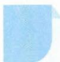
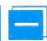

# 8 综合法

## 方法介绍

所谓综合法,即从已知条件出发,利用定义、公理、定理、性质等,经过一系列的推理、论证而得出命题成立的方法.综合法又叫顺推证法.

与分析法(执果索因)刚好相反,综合法的思维方向是“顺推”,即由已知条件出发,逐步推出其必要条件(由因导果),最后导出所需证明的命题成立.当问题比较复杂时,通常先把分析法和综合法结合起来使用,以分析法寻找解答的思路,再用综合法叙述,表达整个解题过程.两种方法相互转换,相互渗透,互为前提,充分运用这一辩证关系,可以拓宽解题思路.

![[高中/思维方法/高中数学思想方法导引2023版/08_综合法/典例示范/典例示范.md]]
![[高中/思维方法/高中数学思想方法导引2023版/08_综合法/巩固练习/巩固练习.md]]
