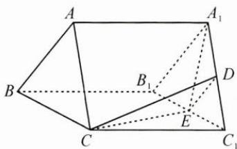
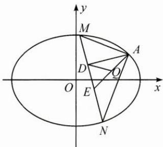
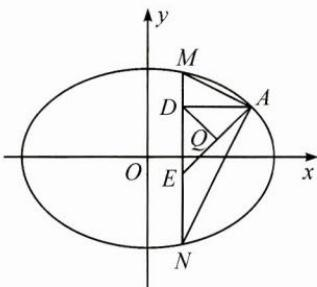

## 典例示范

例 1 如图, 在三棱柱 $ABC-A_{1}B_{1}C_{1}$ 中, $AA_{1}\perp$ 平面 ABC, D, E 分别为 $A_{1}C_{1}, B_{1}C_{1}$ 的中点, AB=AC. 求证:

(1) $AB \parallel$ 平面 CDE;

(2) $A_{1}E\perp CE.$

思路 (1)由 $D, E$ 分别为 $A_{1}C_{1}, B_{1}C_{1}$ 的中点，可得 $A_{1}B_{1} \parallel DE$ ，又 $AB \parallel A_{1}B_{1}$ ，所以 $AB \parallel DE$ ，由线面平行的判定定理可得 $AB \parallel$ 平面 $CDE$ .

(2)由已知易得 $A_{1}E \perp B_{1}C_{1}, CC_{1} \perp A_{1}E$ ，进而得 $A_{1}E \perp$ 平面 $BB_{1}C_{1}C$ .

解答 (1)因为 $D, E$ 分别为 $A_{1}C_{1}, B_{1}C_{1}$ 的中点，所以 $A_{1}B_{1} \parallel DE$ ，又在三棱柱 $ABC - A_{1}B_{1}C_{1}$ 中， $AB \parallel A_{1}B_{1}$ ，所以 $AB \parallel DE$ ，又 $DE \subset$ 平面 $CDE, AB \not\subset$ 平面 $CDE$ ，所以 $AB \parallel$ 平面 $CDE$ .

(2)因为 $AB = AC$ ，所以 $A_{1}B_{1} = A_{1}C_{1}$ ，又 $E$ 为 $B_{1}C_{1}$ 的中点，所以 $A_{1}E \perp B_{1}C_{1}$ .

在三棱柱 $ABC - A_{1}B_{1}C_{1}$ 中， $AA_{1} \perp$ 平面 $ABC$ ，则 $CC_{1} \perp$ 平面 $A_{1}B_{1}C_{1}$ ，又 $A_{1}E \subset$ 平面 $A_{1}B_{1}C_{1}$ ，所以 $CC_{1} \perp A_{1}E$ .

因为 $CC_{1} \cap B_{1}C_{1} = C_{1}$ ，所以 $A_{1}E \perp$ 平面 $BB_{1}C_{1}C$ ，

又 $CE \subset$ 平面 $BB_{1}C_{1}C$ ，所以 $A_{1}E \perp CE$ .

反思 本题主要考查直线与平面平行、直线与平面垂直的判定与性质定理,考查空间想象能力与思维能力,属于中档题.在证明的过程中,我们只需从已知条件出发,结合图形特征,逐步推理,直至找出我们要证明的线面平行或线线垂直所需要的条件,从而使问题得证,这就是利用综合法解决问题的一般思路.

例 2 记 $S_{n}$ 为数列 $\{a_{n}\}$ 的前 n 项和，已知 $\frac{2S_{n}}{n} + n = 2a_{n} + 1$ .

(1) 证明： $\{a_{n}\}$ 是等差数列；

(2) 若 $a_{4}, a_{7}, a_{9}$ 成等比数列，求 $S_{n}$ 的最小值.

思路 (1)要证明数列 $\{a_{n}\}$ 为等差数列, 只需从已知条件出发, 把已知条件转化为 $a_{n} - a_{n-1} = d$ ( $d$ 为常数) 的形式, 利用等差数列的定义即可得证.

(2)要求 $S_{n}$ 的最小值, 只需从已知条件出发, 先求出通项公式 $a_{n}$ , 再利用等差数列的前 $n$ 项和公式求出 $S_{n}$ .

解答 (1) $\frac{2S_n}{n} + n = 2a_n + 1$ ，即 $2S_n + n^2 = 2na_n + n$ ①，当 $n \geqslant 2$ 时， $2S_{n-1} + (n-1)^2 = 2(n-1)a_{n-1} + (n-1)$ ②，①-②得 $2S_n + n^2 - 2S_{n-1} - (n-1)^2 = 2na_n + n - 2(n-1)a_{n-1} - (n-1)$ ，即 $2a_n + 2n-1 = 2na_n - 2(n-1)a_{n-1} + 1$

即 $2(n - 1)a_{n} - 2(n - 1)a_{n - 1} = 2(n - 1)$

所以 $a_{n} - a_{n - 1} = 1, n \geqslant 2$ 且 $n \in \mathbf{N}^{*}$ , 所以 $\{a_{n}\}$ 是以 1 为公差的等差数列.

(2)由(1)可得 $a_{4}=a_{1}+3,a_{7}=a_{1}+6,a_{9}=a_{1}+8$

又 $a_4, a_7, a_9$ 成等比数列，所以 $a_7^2 = a_4a_9$

即 $(a_{1} + 6)^{2} = (a_{1} + 3)(a_{1} + 8)$ ，解得 $a_1 = -12$ ，所以 $a_{n} = n - 13$

所以 $S_{n} = -12n + \frac{n(n - 1)}{2} = \frac{1}{2} n^{2} - \frac{25}{2} n = \frac{1}{2}\left(n - \frac{25}{2}\right)^{2} - \frac{625}{8},$

当 n=12 或 n=13 时， $(S_{n})_{\min}=-78$ .

反思 本题主要考查等差数列的判定与证明、等差数列的通项公式、等差数列的前 $n$ 项和公式，属于中档题。在解题的过程中，我们只需从已知条件出发，利用演绎推理的过程，把已知条件逐步转化为证明一个数列是等差数列应满足的条件，即由因导果。

例3 已知椭圆 $C: \frac{x^2}{a^2} + \frac{y^2}{b^2} = 1 (a > b > 0)$ 的离心率为 $\frac{\sqrt{2}}{2}$ , 且过点 $A(2,1)$ .

(1) 求 C 的方程；

(2) 点 M, N 在 C 上, 且 $AM \perp AN, AD \perp MN, D$ 为垂足, 证明: 存在定点 Q, 使得 $|QD|$ 为定值.

思路 (1)根据离心率的定义,把点A(2,1)代入方程,解方程组即可.

(2)由已知 $AM \perp AN, AD \perp MN$ ，可证得直线 MN 过定点 E，再利用 $AD \perp MN$ ，得出 $AD \perp DE$ ，由于 $|AE|$ 为定值，且 $\triangle ADE$ 为直角三角形，AE 为斜边，所以 AE 的中点 Q 满足 $|QD|$ 为定值 ( $|AE|$ 的一半).

解答 (1)由题意可得 $\left\{ \begin{array}{l} \frac{c}{a} = \frac{\sqrt{2}}{2}, \\ \frac{4}{a^2} + \frac{1}{b^2} = 1, \\ a^2 = b^2 + c^2, \end{array} \right.$ 解得 $a^2 = 6, b^2 = c^2 = 3$

故椭圆 C 的方程为 $\frac{x^{2}}{6} + \frac{y^{2}}{3} = 1$ .

(2)设点 $M(x_{1},y_{1}),N(x_{2},y_{2})$ ，因为 $AM\bot AN$ ，所以 $\overrightarrow{AM}\cdot \overrightarrow{AN} = 0$

$$
(x _ {1} - 2) (x _ {2} - 2) + (y _ {1} - 1) (y _ {2} - 1) = 0 \quad ①
$$

当直线 MN 的斜率存在时, 设其方程为 $y = kx + m$ , 如图 1,

代入椭圆方程，消去 y 并整理得 $(1+2k^{2})x^{2}+4kmx+2m^{2}-6=0$ ，

则 $x_{1} + x_{2} = -\frac{4km}{1 + 2k^{2}}$ ②， $x_{1}x_{2} = \frac{2m^{2} - 6}{1 + 2k^{2}}$ ③，

根据 $y_{1}=kx_{1}+m, y_{2}=kx_{2}+m,$

代入①式整理可得 $(k^{2}+1)x_{1}x_{2}+(km-k-2)(x_{1}+x_{2})+(m-1)^{2}+4=0$

将②③代入得 $(k^2 + 1)\frac{2m^2 - 6}{1 + 2k^2} + (km - k - 2)\left(-\frac{4km}{1 + 2k^2}\right) + (m - 1)^2 + 4 = 0$

化简得 $(2k+3m+1)(2k+m-1)=0.$

因为点 $A(2,1)$ 不在直线 MN 上，所以 $2k+m-1\neq0$ ，

所以 $2k+3m+1=0, k\neq1$ ,

于是直线 MN 的方程为 $y=k\left(x-\frac{2}{3}\right)-\frac{1}{3}$ ，直线 MN 过定点 $E\left(\frac{2}{3},-\frac{1}{3}\right)$ .
当直线 MN 的斜率不存在时，可得 $N(x_{1},-y_{1})$ ，如图 2，
代入①式得 $(x_{1}-2)^{2}+1-y_{1}^{2}=0$ 结合 $\frac{x_{1}^{2}}{6}+\frac{y_{1}^{2}}{3}=1$ ，解得 $x_{1}=2$ （舍去）或 $x_{1}=\frac{2}{3}$ ，
故直线 MN 过点 $E\left(\frac{2}{3},-\frac{1}{3}\right)$ .

图1

图2

由于 $AE$ 为定值，且 $\triangle ADE$ 为直角三角形， $AE$ 为斜边，所以 $AE$ 的中点 $Q$ 满足 $|QD|$ 为定值，即 $|QD| = \frac{1}{2} |AE| = \frac{1}{2}\sqrt{\left(2 - \frac{2}{3}\right)^2 + \left(1 + \frac{1}{3}\right)^2} = \frac{2\sqrt{2}}{3}$ .

由于 $A(2,1), E\left(\frac{2}{3}, -\frac{1}{3}\right)$ ，故由中点坐标公式可得 $Q\left(\frac{4}{3}, \frac{1}{3}\right)$ .

故存在点 $Q\left(\frac{4}{3},\frac{1}{3}\right)$ ，使得 $|QD|$ 为定值.

反思 本题主要考查了椭圆标准方程的求法, 直线与椭圆的位置关系, 以及椭圆中定点、定值问题的解题策略. 在解答的过程中, 采用了分析法进行演绎推理, 从已知条件 $AM \perp AN$ 出发, 得出直线 $MN$ 过定点 $E$ , 从而推出 $|AE|$ 为定值, 再利用 $\triangle ADE$ 为直角三角形, $AE$ 为斜边, 根据直角三角形斜边上的中线等于斜边的一半, 得出 $|QD|$ 为定值.

