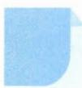

# 9 比较法

# 引路人 杭州市余杭高级中学 庞海燕

本思想方法涉及模块: 函数、导数、数列、不等式.

![[高中/思维方法/高中数学思想方法导引2023版/09_比较法/方法介绍/方法介绍.md]]
![[高中/思维方法/高中数学思想方法导引2023版/09_比较法/典例示范/典例示范.md]]
![[高中/思维方法/高中数学思想方法导引2023版/09_比较法/巩固练习/巩固练习.md]]
