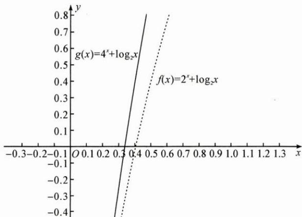

## (三)构造函数比较

例3 若 $2^{a} + \log_{2}a = 4^{b} + 2\log_{4}b$ ，则（）. A. $a > 2b$ B. $a <   2b$ C. $a > b^{2}$ D. $a <   b^{2}$

思路 显然 a, b 的具体形式难以解出, 难以作差、作商比较, 观察条件结构, 将其变形为 $2^{a} + \log_{2}a = 2^{2b} + \log_{2}b$ , 利用单调性比较.

解答 首先比较 $a$ 和 $2b, 2^a + \log_2 a = 2^{2b} + \log_2 b < 2^{2b} + \log_2 2b$ , 考虑函数 $f(x) = 2^x + \log_2 x, f(x)$ 在 $(0, +\infty)$ 上单调递增, 由 $f(a) < f(2b)$ , 得 $a < 2b$ .

再比较 $a$ 和 $b^2, 2^a + \log_2 a = 4^b + \log_2 b$ ，考虑函数 $g(x) = 4^x + \log_2 x$ ，如图，可知 $f(x) < g(x)$ 在 $(0, +\infty)$ 上恒成立，而 $f(a) = g(b)$ ，分析图象知无法判断 $a$ 和 $b^2$ 的大小.

综上,故选 B.

反思 构造函数,利用单调性比较两个数或式的大小,不仅可以穿插在作差、作商比较的过程中,亦适用于作差、作商比较有困难的情况.

