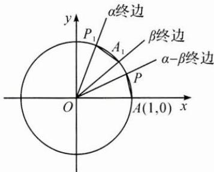
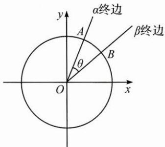

## (一)构造图形、构造向量

例 1 证明两角差的余弦公式: $\cos(\alpha-\beta)=\cos\alpha\cos\beta+\sin\alpha\sin\beta.$

思路 在平面直角坐标系中作出任意角 $\alpha, \beta$ 的终边，则角 $\alpha - \beta$ 也能在图中表示出来， $(\cos \alpha, \sin \alpha), (\cos \beta, \sin \beta)$ 分别是角 $\alpha, \beta$ 的终边与单位圆的交点坐标，因此可以通过构造图形来证明。

证明 证法1:如图,不妨令 $\alpha\neq2k\pi+\beta,k\in Z$ . 设单位圆与 x 轴相交于点 A(1,0)，以 x 轴非负半轴为始边作角 $\alpha,\beta,\alpha-\beta$ ，它们的终边分别与单位圆相交于点 $P_{1}(\cos\alpha,\sin\alpha)$ ， $A_{1}(\cos\beta,\sin\beta)$ ,

$$
P (\cos (\alpha - \beta), \sin (\alpha - \beta))
$$

连接 $A_{1}P_{1}, AP$ ，可知 $\widehat{AP} = \widehat{A_{1}P_{1}}$ ，所以 $AP = A_{1}P_{1}$ .

根据两点间距离公式，

得 $\left[\cos (\alpha -\beta) - 1\right]^{2} + \sin^{2}(\alpha -\beta) = (\cos \alpha -\cos \beta)^{2} + (\sin \alpha -\sin \beta)^{2},$

化简得 $\cos(\alpha-\beta)=\cos\alpha\cos\beta+\sin\alpha\sin\beta.$

当 $\alpha=2k\pi+\beta,k\in Z$ 时，容易证明上式仍然成立.

证法 2: 如图, 以 x 轴非负半轴为始边作角 $\alpha, \beta$ , 它们的终边分别与单位圆相交于点 A, B, 则 $\overrightarrow{OA} = (\cos\alpha, \sin\alpha), \overrightarrow{OB} = (\cos\beta, \sin\beta)$ .

由向量数量积的坐标表示,有 $\overrightarrow{OA}\cdot\overrightarrow{OB}=\cos\alpha\cos\beta+\sin\alpha\sin\beta.$

设 $\overrightarrow{OA}$ 与 $\overrightarrow{OB}$ 的夹角为 $\theta$ ，则 $\overrightarrow{OA} \cdot \overrightarrow{OB} = |\overrightarrow{OA}| |\overrightarrow{OB}| \cos \theta = \cos \theta$

所以 $\cos\theta=\cos\alpha\cos\beta+\sin\alpha\sin\beta.$

另一方面， $\alpha - \beta = 2k\pi \pm \theta, k \in \mathbf{Z}$ ，于是 $\cos (\alpha - \beta) = \cos \alpha \cos \beta + \sin \alpha \sin \beta.$

反思 两角差的余弦公式是三角恒等变换的基础,其他三角公式可以在此公式的基础上变形得到.证明此公式的方法有很多:在人教A版教材必修第一册“三角恒等变换”中,通过构造图形,由两点间距离公式推得;在必修第二册“向量”中,通过构造向量、构造图形,由数量积运算推得.

(二)构造方程

例 2 在 $\triangle ABC$ 中, $AB=8, AC=5, BC=7, O$ 是 $\triangle ABC$ 的外心, $\overrightarrow{AO}=x\overrightarrow{AB}+y\overrightarrow{AC}$ ,求 $x,y$ 的值.

思路 在向量等式 $\overrightarrow{AO} = x\overrightarrow{AB} +y\overrightarrow{AC}$ 的两边同时点乘 $\overrightarrow{AB}$ ，再同时点乘 $\overrightarrow{AC}$ ，构造方程组.

解答 由向量数量积的几何意义可得，

$$
\overrightarrow {A O} \cdot \overrightarrow {A B} = \frac {\overrightarrow {A B ^ {2}}}{2} = 3 2, \overrightarrow {A O} \cdot \overrightarrow {A C} = \frac {\overrightarrow {A C ^ {2}}}{2} = \frac {2 5}{2},
$$

$$
\text {又} \overrightarrow {A B} \cdot \overrightarrow {A C} = | \overrightarrow {A B} | | \overrightarrow {A C} | \cos A = | \overrightarrow {A B} | | \overrightarrow {A C} | \frac {| \overrightarrow {A B} | ^ {2} + | \overrightarrow {A C} | ^ {2} - | \overrightarrow {B C} | ^ {2}}{2 | \overrightarrow {A B} | | \overrightarrow {A C} |} = 2 0,
$$

构造方程组 $\left\{\begin{aligned}\overrightarrow{AO}\cdot\overrightarrow{AB}&=x\overrightarrow{AB^{2}}+y\overrightarrow{AC}\cdot\overrightarrow{AB},\\\overrightarrow{AO}\cdot\overrightarrow{AC}&=x\overrightarrow{AC}\cdot\overrightarrow{AB}+y\overrightarrow{AC^{2}},\end{aligned}\right.$ 即 $\left\{\begin{aligned}32&=64x+20y,\\\frac{25}{2}&=20x+25y,\end{aligned}\right.$ 解得 $\left\{\begin{aligned}x&=\frac{11}{24},\\ y&=\frac{2}{15}.\end{aligned}\right.$

反思 在向量等式的两边点乘一个非零向量, 把向量等式转化为代数方程, 从而通过构造方程求得未知数的值.

(三)构造函数

例 3 若对于任意 x>0，不等式 $2ae^{2x}-\ln x+\ln a\geqslant0$ 恒成立，则实数 a 的最小值为 \_\_\_\_.

思路 设 $f(x) = 2ae^{2x} - \ln x + \ln a, f(x) \geqslant 0$ 恒成立，即 $f(x)_{\min} \geqslant 0$ ，因此可以通过研究函数的单调性确定其最小值。进一步观察式子结构，可以变形为 $2ae^{2x} + \ln a + 2x \geqslant \ln x + 2x, \ln (ae^{2x}) + 2ae^{2x} \geqslant \ln x + 2x$ ，不等式两边结构相同，可以构造函数，利用函数的单调性解决。

解答 解法 1: $f(x)=2ae^{2x}-\ln x+\ln a\geqslant0$ , $f'(x)=4ae^{2x}-\frac{1}{x}$ .

因为 a>0，所以 $f'(x)$ 在 $(0,+\infty)$ 上单调递增，

又当 $x \to 0$ 时， $f'(x) \to -\infty$ ，当 $x \to +\infty$ 时， $f'(x) \to +\infty$

所以 $f'(x) = 0$ 有唯一解，设为 $x_0$ ，则 $f(x)$ 在 $(0, x_0)$ 上单调递减，在 $(x_0, +\infty)$ 上单调递增， $f(x)_{\min} = f(x_0) = 2a e^{2x_0} - \ln x_0 + \ln a$ .

由 $f^{\prime}(x_0) = 0$ 得 $4a\mathrm{e}^{2x_0} = \frac{1}{x_0}$

两边取以 e 为底的对数得 $\ln4a+2x_{0}=-\ln x_{0}$ ,

因此 $f(x_0) = \frac{1}{2x_0} +\ln 4a + 2x_0 + \ln a\geqslant 2 + \ln 4a^2\geqslant 0$ ，得 $a\geqslant \frac{1}{2\mathrm{e}}.$ 故 $a$ 的最小值为 $\frac{1}{2\mathrm{e}}.$

解法 2: 在不等式 $2ae^{2x}-\ln x+\ln a \geqslant 0$ 的两边同时加 2x,

变形得 $2ae^{2x} + \ln a + 2x\geqslant \ln x + 2x$ ，即 $\ln (a\mathrm{e}^{2x}) + 2a\mathrm{e}^{2x}\geqslant \ln x + 2x.$

构造函数 $g(x)=\ln x+2x$ ，可得 $g(a\mathrm{e}^{2x})\geqslant g(x)$ .

因为 $g(x)$ 在 $(0, +\infty)$ 上单调递增，因此 $a\mathrm{e}^{2x} \geqslant x$ 对于任意 $x > 0$ 恒成立，即 $a \geqslant \frac{x}{\mathrm{e}^{2x}}$ 对于任意 $x > 0$ 恒成立.

构造函数 $h(x)=\frac{x}{\mathrm{e}^{2x}}$ ，则 $h'(x)=\frac{1-2x}{\mathrm{e}^{2x}}$ ，

$h(x)$ 在 $\left(0, \frac{1}{2}\right)$ 上单调递增，在 $\left(\frac{1}{2}, +\infty\right)$ 上单调递减，

$h(x)_{\mathrm{max}} = h\left(\frac{1}{2}\right) = \frac{1}{2\mathrm{e}},$

因此 $a \geqslant \frac{1}{2\mathrm{e}}$ ，故 $a$ 的最小值为 $\frac{1}{2\mathrm{e}}$ .

解法 3: $2ae^{2x}-\ln x+\ln a \geqslant 0 \Leftrightarrow 2ae^{2x} \geqslant \ln \frac{x}{a}$

$$
\Leftrightarrow 2 x \mathrm{e} ^ {2 x} \geqslant \ln {\frac {x}{a}} \cdot {\frac {x}{a}} \Leftrightarrow 2 x \mathrm{e} ^ {2 x} \geqslant \ln {\frac {x}{a}} \cdot \mathrm{e} ^ {\ln {\frac {x}{a}}},
$$

构造函数 $G(x) = x\mathrm{e}^{x}$ ，则 $G(2x) \geqslant G\left(\ln \frac{x}{a}\right)$ 对任意 $x > 0$ 恒成立. 以下略.

解法 $4:2ae^{2x} - \ln x + \ln a\geqslant 0\Leftrightarrow 2ae^{2x}\geqslant \ln \frac{x}{a}$

$$
\Leftrightarrow 2 x \mathrm{e} ^ {2 x} \geqslant \ln \frac {x}{a} \cdot \frac {x}{a} \Leftrightarrow \ln \mathrm{e} ^ {2 x} \cdot \mathrm{e} ^ {2 x} \geqslant \ln \frac {x}{a} \cdot \frac {x}{a},
$$

构造函数 $H(x) = x\ln x$ ，则 $H(\mathrm{e}^{2x})\geqslant H\left(\frac{x}{a}\right)$ 对任意 $x > 0$ 恒成立.以下略

反思 本题解法 2～4 通过发现代数式的同构特点, 构造函数解决问题, 运算量比解法 1 小. 在构造函数解决问题时, 可根据问题形式的特点, 分析问题的已知条件和结论的特性, 从函数的定义域、值域、奇偶性、单调性、有界性、图象等方面加以分析、判断, 合理构造与之相关的函数, 然后运用所构造函数的性质巧妙解决原问题.
