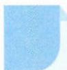

# 11 基本量法

## 方法介绍

在数学运算过程中,往往需要根据题目给的条件,设定未知量,分析已知量和未知量之间的关系,列出相应等式求解.在这些已知量、未知量中,选定其中的一些量,则其他的量就可以用它们来表达,这些量我们称之为基本量.在解题过程中如何选择基本量,是分析、解决问题的一个重要环节.

![[高中/思维方法/高中数学思想方法导引2023版/11_基本量法/典例示范/典例示范.md]]
![[高中/思维方法/高中数学思想方法导引2023版/11_基本量法/巩固练习/巩固练习.md]]
