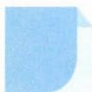

# 12 对称法

## 方法介绍

对称法的运用包括发现对称与构造对称，在高中阶段应用极为广泛。对称方式包括关于点、线、面对称，对称形式包括镜面对称、中心对称，涉及函数、立体几何、解析几何等重点内容。对称法的应用过程中需要注意的是，要对是否具有对称性作出正确的判断，有些图形的对称判断比较直观，对于一些较为复杂的问题，还要加以计算与推理。

![[高中/思维方法/高中数学思想方法导引2023版/12_对称法/典例示范/典例示范.md]]
![[高中/思维方法/高中数学思想方法导引2023版/12_对称法/巩固练习/巩固练习.md]]
