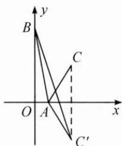
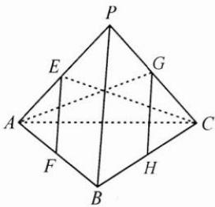

## 典例示范

例1 设函数 $f(x)$ 的定义域为 $\mathbf{R}, f(x+1)$ 为奇函数, $f(x+2)$ 为偶函数, 当 $x \in [1,2]$ 时, $f(x)=ax^{2}+b$ . 若 $f(0)+f(3)=6$ , 则 $f\left(\frac{9}{2}\right)=(\quad)$ .

A. $-\frac{9}{4}$ B. $-\frac{3}{2}$ C. $\frac{7}{4}$ D. $\frac{5}{2}$

思路 由条件容易发现函数图象具有轴对称性与中心对称性,所以考虑利用对称性将 $f(0)$ , $f(3)$ 转化为区间 $[1,2]$ 上某处的函数值,从而解决问题.

解答 因为 $f(x+1)$ 为奇函数, 所以其函数图象关于点 $(1,0)$ 中心对称, 因为 $f(x+2)$ 为偶函数, 所以其函数图象关于直线 x=2 轴对称, 因此 $f(0)+f(3)=-f(2)+f(1)=6$ .

又因为 $f(1)=0$ ，所以 $f(2)=-6$ ，得 $\left\{\begin{aligned}a+b=0,\\ 4a+b=-6,\end{aligned}\right.$ 解得 a=-2, b=2，
由对称性可得 $f\left(\frac{9}{2}\right)=f\left(-\frac{1}{2}\right)=-f\left(\frac{5}{2}\right)=-f\left(\frac{3}{2}\right)=\frac{5}{2}$ ，故选 D.

反思 本题的关键是发现函数图象的对称性,利用对称性将条件与所求的自变量的函数值转化为给定区间内自变量的函数值,从而解决问题.遇到图象具有对称性的函数,给定某个区间的信息,转求其他区间内信息的相关问题,都可以采取这种策略.

例2 函数 $f(x) = \sqrt{x^2 + 4} + \sqrt{x^2 - 2x + 2}$ 的最小值为 \_\_\_\_.

思路 由根号内二次式的结构,容易联想到配成完全平方,因此该函数可以看成两个距离之和.

解答 $f(x) = \sqrt{x^2 + 2^2} +\sqrt{(x - 1)^2 + 1^2},$

设 $A(x,0),B(0,2),C(1,1)$

则可知 $f(x)=|AB|+|AC|$ ,

如图,作点 $C(1,1)$ 关于 x 轴的对称点 $C'(1,-1)$ ,

则 $|AB| + |AC| = |AB| + |AC'| \geqslant |BC'| = \sqrt{10}$ ,

当 $A, B, C$ 三点共线时取等号，

因此 $f(x)_{\min} = \sqrt{10}$ .

反思 本题的关键是通过构造镜面对称变换,将函数的最值问题转化为两点之间的最短距离问题.这种构造对称的思想方法不单可以运用在平面问题中,在许多空间的最值问题中也十分重要.

例3 已知三棱锥 $P - ABC$ 的四个顶点在球 $O$ 的球面上, $PA = PB = PC$ , $\triangle ABC$ 是边长为 2 的正三角形, $E, F$ 分别是 $PA, AB$ 的中点, $\angle CEF = 90^\circ$ , 则球 $O$ 的体积为 ( ).

A. $8\sqrt{6}\pi$ B. $4\sqrt{6}\pi$ C. $2\sqrt{6}\pi$ D. $\sqrt{6}\pi$

思路 由正三棱锥结构的对称性,可以联想到对称的几何元素具有相同的性质,从而可以巧妙地利用垂直条件,快速解决问题.

解答 三棱锥 P-ABC 为正三棱锥, 如图, 取 PC 的中点 G, BC 的中点 H, 连接 AG, GH, 则由 $\angle CEF = 90^{\circ}$ 和正三棱锥的对称性易知 $AG \perp GH$ .

因为 $BP \parallel EF \parallel GH$ ，所以 $BP \perp AG, BP \perp CE,$

因为 AG 与 CE 相交且都在平面 APC 内, 所以 BP ⊥ 平面 APC,

所以 $BP \perp PA, BP \perp PC$ .

由正三棱锥的对称性可知 PA, PB, PC 两两垂直，

且 $PA = PB = PC = \sqrt{2}$ ，可将该三棱锥还原成一个以 $PA, PB, PC$ 为棱的正方体，正方体的体对角线即为球 $O$ 的直径，即 $2R = \sqrt{6}, R = \frac{\sqrt{6}}{2}$ .

所以球 O 的体积为 $V=\frac{4}{3}\pi R^{3}=\sqrt{6}\pi$ ，故选 D.

反思 本题的关键是利用正三棱锥结构的对称性,通过构造对称的几何元素,使得垂直条件得到灵活运用.这种发现对称、构造对称、利用对称的思想方法在许多几何问题中十分重要.

