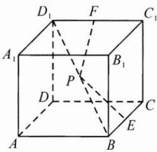

<!-- question-source:start -->
3. 如图, 在棱长为 1 的正方体 $ABCD - A_{1}B_{1}C_{1}D_{1}$ 中, $E$ 为棱 $BC$ 的中点, $F$ 是棱 $C_{1}D_{1}$ 上的动点, 若 $P$ 为线段 $BD_{1}$ 上的动点, 则 $PE + PF$ 的最小值为 \_\_\_\_.

<!-- question-source:end -->

![[Q00009715A1]]
