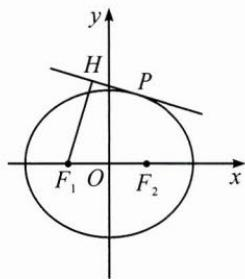

<!-- question-source:start -->
5. 如图, 已知椭圆方程为 $\frac{x^2}{4} + \frac{y^2}{3} = 1, F_1, F_2$ 分别为其左、右焦点, $P$ 为椭圆上的动点, 过点 $F_1$ 作椭圆在点 $P$ 处的切线的垂线, 垂足为 $H$ , 求点 $H$ 的轨迹方程.

<!-- question-source:end -->

![[Q00009717A1]]
