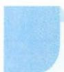

# 13 增量法

引路人 杭州师范大学附属未来科技城学校 李学军

本思想方法涉及模块: 函数、导数、数列、不等式、解析几何、立体几何、三角、向量.

![[高中/思维方法/高中数学思想方法导引2023版/13_增量法/方法介绍/方法介绍.md]]
![[高中/思维方法/高中数学思想方法导引2023版/13_增量法/典例示范/典例示范.md]]
![[高中/思维方法/高中数学思想方法导引2023版/13_增量法/巩固练习/巩固练习.md]]
