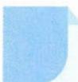

# 14 导数法

# 引路人 杭州学军中学 张春杰

本思想方法涉及模块: 函数、解析几何、立体几何、三角函数、不等式.

![[高中/思维方法/高中数学思想方法导引2023版/14_导数法/方法介绍/方法介绍.md]]
![[高中/思维方法/高中数学思想方法导引2023版/14_导数法/典例示范/典例示范.md]]
![[高中/思维方法/高中数学思想方法导引2023版/14_导数法/巩固练习/巩固练习.md]]
