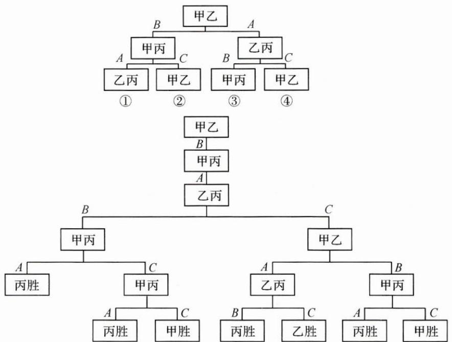

## (一)计数问题,枚举开路

例 1 将一个骰子连续抛掷三次,它落地时向上的点数依次成等差数列的情况有多少种?

思路 关键词是点数依次成等差数列,可以有两个思路:①把抛掷三次的所有结果一一列举,从中找到“点数依次成等差数列”的情况;②先按照等差数列的规律分类,得到每类可能的情况,再累加所有情况.

解答 思路①,一个骰子连续抛掷三次,共产生216种结果,从中找出满足条件的有18种,这样列举显然费时费力,容易遗漏.

改变策略,引进思路②,按照等差数列的规律分类.

公差为 0 的情况有 6 种, 分别是 $(1,1,1)$ , $(2,2,2)$ , $(3,3,3)$ , $(4,4,4)$ , $(5,5,5)$ , $(6,6,6)$ ;

公差为 1 的情况有 4 种, 分别是 $(1,2,3)$ , $(2,3,4)$ , $(3,4,5)$ , $(4,5,6)$ ;

公差为 2 的情况有 2 种, 分别是 $(1,3,5)$ , $(2,4,6)$ ;

公差为-1的情况有4种，分别是(3,2,1)，(4,3,2)，(5,4,3)，(6,5,4)；

公差为-2的情况有2种，分别是 $(5,3,1)$ ， $(6,4,2)$ .

故满足条件的情况共有 18 种.

反思 当所枚举的情形较多时,可以先对问题进行有效分类,这样可以大大减轻枚举法带来的一一列举的压力,还可更好地满足“不重不漏”的要求.

(二)古典概型,善用枚举

例 2 甲、乙、丙三位同学进行羽毛球比赛,约定赛制如下:累计负两场者被淘汰;比赛前抽签决定首先比赛的两人,另一人轮空;每场比赛的胜者与轮空者进行下一场比赛,负者下一场轮空,直至有一人被淘汰;当一人被淘汰后,剩余的两人继续比赛,直至其中一人被淘汰,另一人最终获胜,比赛结束.

经抽签,甲、乙首先比赛,丙轮空.设每场比赛双方获胜的概率都为 $\frac{1}{2}$ .

(1)求甲连胜四场的概率；

(2) 求需要进行第五场比赛的概率；

(3)求丙最终获胜的概率.

思路 本题涉及比赛中轮空、淘汰等情况,在解决问题时有一定的困难.可从分类、枚举等角度入手,通过画树状图、列表的方式来处理.

解答 如图,先将比赛情况分成四类,对情况①具体研究,再利用对称性,得到其他情况下相应的概率.其中,A表示甲输掉比赛,B表示乙输掉比赛,C表示丙输掉比赛.

在情况①中，甲获胜的概率为 $\frac{1}{32} +\frac{1}{32} = \frac{1}{16}$ ，乙获胜的概率为 $\frac{1}{32}$ ，丙获胜的概率为 $\frac{1}{16} +\frac{1}{32} +\frac{1}{32} +\frac{1}{32} = \frac{5}{32}$ .列表如下.

<table><tr><td>项目</td><td>甲获胜概率</td><td>乙获胜概率</td><td>丙获胜概率</td></tr><tr><td>情况1</td><td> $\frac{1}{16}$ </td><td> $\frac{1}{32}$ </td><td> $\frac{5}{32}$ </td></tr><tr><td>情况2</td><td> $\frac{5}{32}$ </td><td> $\frac{1}{32}$ </td><td> $\frac{1}{16}$ </td></tr><tr><td>情况3</td><td> $\frac{1}{32}$ </td><td> $\frac{1}{16}$ </td><td> $\frac{5}{32}$ </td></tr><tr><td>情况4</td><td> $\frac{1}{32}$ </td><td> $\frac{5}{32}$ </td><td> $\frac{1}{16}$ </td></tr><tr><td>总计</td><td> $\frac{9}{32}$ </td><td> $\frac{9}{32}$ </td><td> $\frac{7}{16}$ </td></tr></table>

(1)甲连胜四场的概率 $P(\text{甲})=\left(\frac{1}{2}\right)^{4}=\frac{1}{16}.$

(2)由树状图易知四场结束比赛的概率是 $\frac{1}{4}$ ，所以，需要进行第五场比赛的概率是 $\frac{3}{4}$ .

(3)丙最终获胜的概率 $P(\text{丙})=\frac{7}{16}$ .

反思 画树状图和列表分析在计算机领域有着广泛运用. 它们作为枚举法的表现形式, 具有直观清晰、操作性强等特征. 在本题中, 使用枚举法能很好地解决读题障碍, 降低解题难度.
