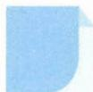

# 16 向量法

## 方法介绍

所谓向量法,是指对平面或立体几何中的边赋予方向,利用向量运算律、向量的性质及向量基本定理解决一些简单的几何问题的方法,也指将函数、不等式中的代数结构转化为向量的模或两向量的夹角等,进而解决问题的方法.

用向量法解决平面几何问题有“三部曲”（向量化 $\rightarrow$ 向量运算 $\rightarrow$ “翻译”），可以程序化地解决问题。但用向量法解决平面几何问题也并非百试百灵，一般比较适合解决垂直、平行、共线等定性问题和计算长度、角度等定量问题。

![[高中/思维方法/高中数学思想方法导引2023版/16_向量法/典例示范/典例示范.md]]
![[高中/思维方法/高中数学思想方法导引2023版/16_向量法/巩固练习/巩固练习.md]]
