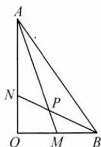
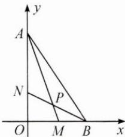
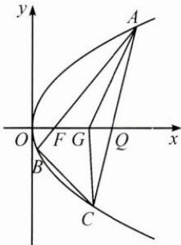

## 典例示范

例 1 如图, 在 Rt△OAB 中, ∠AOB=90°, OA=3, OB=2, 点 M 在 OB 上, 且 OM=1, 点 N 在 OA 上, 且 ON=1, P 为 AM 与 BN 的交点, 求 ∠MPN.

思路 求 $\angle MPN$ 可以转化为求 $PM$ 和 $PN$ 的夹角,题目已知 $OA$ 和 $OB$ 的长度和夹角,所以既可以以 $\overrightarrow{OA}$ 和 $\overrightarrow{OB}$ 为基底,也可以分别以 $OA,OB$ 为 $x$ 轴、 $y$ 轴建立平面直角坐标系,利用向量的夹角公式解决问题.

解答 解法 1: 设 $\overrightarrow{OA} = a, \overrightarrow{OB} = b, \overrightarrow{AM}$ 与 $\overrightarrow{BN}$ 的夹角为 $\theta$ ,

则 $\overrightarrow{OM} = \frac{1}{2}\pmb{b},\overrightarrow{ON} = \frac{1}{3}\pmb {a},|\pmb {a}| = 3,|\pmb {b}| = 2,$

因为 $\overrightarrow{AM}=\overrightarrow{OM}-\overrightarrow{OA}=\frac{1}{2}\boldsymbol{b}-\boldsymbol{a},\overrightarrow{BN}=\overrightarrow{ON}-\overrightarrow{OB}=\frac{1}{3}\boldsymbol{a}-\boldsymbol{b},$

所以 $\overrightarrow{AM} \cdot \overrightarrow{BN} = \left(\frac{1}{2}\pmb{b} - \pmb{a}\right) \cdot \left(\frac{1}{3}\pmb{a} - \pmb{b}\right) = -5$

又 $|\overrightarrow{AM}| = \sqrt{10}, |\overrightarrow{BN}| = \sqrt{5}$ , 所以 $\cos \theta = \frac{\overrightarrow{AM} \cdot \overrightarrow{BN}}{|\overrightarrow{AM}| |\overrightarrow{BN}|} = \frac{-5}{\sqrt{5} \times \sqrt{10}} = -\frac{\sqrt{2}}{2}$ .

因为 $\theta \in [0, \pi]$ , 所以 $\theta = \frac{3}{4} \pi$ .

又因为 $\angle MPN$ 为 $\overrightarrow{AM}$ 与 $\overrightarrow{BN}$ 的夹角，所以 $\angle MPN = \frac{3}{4}\pi.$

解法 2: 如图, 以 O 为坐标原点, OB 为 x 轴, OA 为 y 轴, 建立直角坐标系, 则 A(0,3), B(2,0), M(1,0), N(0,1),

可得 $\overrightarrow{AM}=(1,-3),\overrightarrow{BN}=(-2,1)$ .

设 $\overrightarrow{AM}$ 与 $\overrightarrow{BN}$ 的夹角为 $\theta$ ，

则 $\cos \theta = \frac{\overrightarrow{AM} \cdot \overrightarrow{BN}}{|\overrightarrow{AM}| |\overrightarrow{BN}|} = \frac{-5}{\sqrt{5} \times \sqrt{10}} = -\frac{\sqrt{2}}{2}$ .

因为 $\theta \in [0, \pi]$ , 所以 $\theta = \frac{3}{4}\pi$ , 所以 $\angle MPN = \frac{3}{4}\pi$ .

反思 利用向量法解决平面几何问题,首先需要向量化,即将题目的问题和关键条件中的边赋予方向,然后利用基向量或者平面直角坐标系中点的坐标加以运算,最后将两个向量的夹角余弦值“翻译”为两条边的夹角.

例2 求函数 $f(x) = \sqrt{x^2 + 4} + \sqrt{(3 - x)^2 + 9}$ 的最小值.

思路 遇到形如 $\sqrt{(a - c)^2 + (b - d)^2}$ 的结构，可以联想并应用向量的模长.

解答 设 $a = (x,2), b = (3 - x,3)$ ，因为 $|a + b| \leqslant |a| + |b|$ ，

所以 $\sqrt{x^2 + 4} +\sqrt{(3 - x)^2 + 9}\geqslant \sqrt{34},$

当且仅当 $a \parallel b$ 且 $a$ 与 $b$ 方向相同，即 $x = \frac{6}{5}$ 时，等号成立.

故所求最小值为 $\sqrt{34}$ .

反思 这是一道函数不等式题目,由于向量也可以用坐标表示,所以向量的运算可以看成变量和字母运算的结果,这是借助向量解决函数、不等式问题的基础.用向量解决函数、不等式问题时,需要关注代数式结构,发挥想象.

例 3 如图, 已知过点 $F(1,0)$ 的直线与抛物线 $y^{2}=4x$ 交于 A, B 两点, 点 C 在抛物线上, 使得 $\triangle ABC$ 的重心 G 在 x 轴上, 直线 AC 交 x 轴于点 Q (点 Q 在点 F 的右侧). 记 $\triangle AFG, \triangle CQG$ 的面积分别为 $S_{1}, S_{2}$ , 求 $\frac{S_{1}}{S_{2}}$ 的最小值及此时点 G 的坐标.

思路 本题所求面积之比, 是 $\triangle ABC$ 的重心 $G$ 与边 $AB$ 的一部分 $AF$ 构成的三角形面积 $S_{1}$ 和重心 $G$ 与另一边 $AC$ 的一部分 $CQ$ 构成的三角形面积 $S_{2}$ 的比值. 可以先利用向量表达重心 $G$ , 再根据点 $F, G, Q$ 均在 $x$ 轴上, “翻译”三点共线这一几何条件来转化题目条件, 最后尝试解答.

解答 设 $\overrightarrow{AF} = \lambda \overrightarrow{AB},\overrightarrow{AQ} = \mu \overrightarrow{AC}$ ，其中 $\lambda ,\mu \in (0,1)$

因为 G 为 $\triangle ABC$ 的重心, 所以 $\overrightarrow{AG} = \frac{1}{3}\overrightarrow{AB} + \frac{1}{3}\overrightarrow{AC} = \frac{1}{3\lambda}\overrightarrow{AF} + \frac{1}{3\mu}\overrightarrow{AQ}$ ,

又因为 F, G, Q 三点共线，所以 $\frac{1}{3\lambda} + \frac{1}{3\mu} = 1, \lambda = \frac{\mu}{3\mu - 1}$ .

因为 $\frac{S_{1}}{S_{2}}=\frac{S_{\triangle AFG}}{S_{\triangle CQG}}=\frac{\lambda S_{\triangle ABG}}{(1-\mu)S_{\triangle AGC}}=\frac{\lambda}{1-\mu}$ ，代入 $\lambda=\frac{\mu}{3\mu-1}$

可得 $\frac{S_1}{S_2} = \frac{\frac{\mu}{3\mu - 1}}{1 - \mu} = \frac{1}{4 - (3\mu + \frac{1}{\mu})} \geqslant \frac{1}{4 - 2\sqrt{3\mu \cdot \frac{1}{\mu}}} = \frac{2 + \sqrt{3}}{2},$

当且仅当 $\mu=\frac{\sqrt{3}}{3}$ 时取等号，所以当 $G(2,0)$ 时， $\frac{S_{1}}{S_{2}}$ 有最小值 $\frac{2+\sqrt{3}}{2}$ .

反思 解析几何中图形的重要位置关系(如平行、垂直、相交、三点共线等)和数量关系(如距离、角等),如果能用向量代数运算进行表达,运算量将大大减少.

