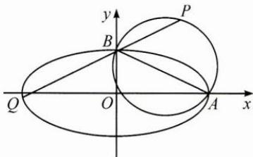

<!-- question-source:start -->
3. 如图, 已知椭圆 $E: \frac{x^2}{4} + y^2 = 1$ , 若 $A$ 是椭圆的右顶点, $B$ 是椭圆的上顶点, $P(x_0, y_0) (y_0 > 1)$ 在以 $AB$ 为直径的圆上, 延长 $PB$ , 交椭圆 $E$ 于点 $Q$ , 求 $|BP||BQ|$ 的最大值.

<!-- question-source:end -->

![[Q00009731A1]]
