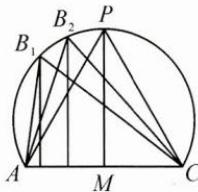
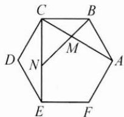
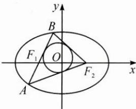

## 典例示范

例 1 在 $\triangle ABC$ 中,内角 $A,B,C$ 的对边分别为 $a,b,c$ ,已知 $b=1,B=\frac{\pi}{3}$ ,求:

(1) $\triangle ABC$ 的周长 $C_{\triangle ABC}$ 的取值范围；

(2) $AC$ 边上的中线长的取值范围；

(3) $\triangle ABC$ 的内切圆半径r的取值范围.

思路 因为 $b = 1, B = \frac{\pi}{3}$ , 由平面几何知识知点 $B$ 的轨迹为圆弧, 当点 $B$ 运动时, $\triangle ABC$ 的形状与大小随之发生变化, 可借助图形直观地解决问题.

解答 (1)由 $b^{2} = a^{2} + c^{2} - 2ac\cos B$ 知 $1 = a^{2} + c^{2} - ac$ ，即 $1 + 3ac = (a + c)^{2}$ 说明周长随面积同步变化.

由题意, 点 B 的轨迹为圆弧, 由对称性, 取其中一半考虑.

如图, 设 AC 的中垂线与圆弧交于点 P, 则 P 为直径的一个端点. 结合图形可知, 当点 B 由点 A (或 C) 沿圆弧运动到点 P 时, $\triangle ABC$ 的高逐渐变大, $S_{\triangle ABC}$ 逐渐变大. 所以当点 B 无限靠近点 A (或 C) 时, $\triangle ABC$ 的周长趋向于 2; 当点 B 位于点 P 处时, $\triangle ABC$ 的周长的最大值为 3. 所以 $C_{\triangle ABC} \in (2, 3]$ .

(2)取 $AC$ 的中点 $M$ , 则 $AC$ 边上的中线为 $BM$ , 根据平行四边形的性质有 $(2BM)^{2} + AC^{2} = 2(BA^{2} + BC^{2})$ , 即 $(2BM)^{2} + 1 = 2(a^{2} + c^{2})$ ,

则 $(2BM)^{2}=2ac+1$ ，说明中线BM的长随面积同步变化.

当点 $B$ 无限靠近点 $A$ (或 $C$ ) 时, $BM$ 趋向于 $\frac{1}{2}$ ; 当点 $B$ 位于点 $P$ 处时, $ac = 1$ , $BM = \frac{\sqrt{3}}{2}$ . 所以 $BM \in \left(\frac{1}{2}, \frac{\sqrt{3}}{2}\right]$ .

(3)由 $S_{\triangle ABC} = \frac{1}{2} (a + b + c)r = \frac{1}{2} ac\sin B$ ，得 $r = \frac{\frac{\sqrt{3}}{2}ac}{a + c + 1}$ 因为 $1 + 3ac = (a + c)^2$ ，所以 $r = \frac{\frac{\sqrt{3}}{6}[(a + c)^2 - 1]}{a + c + 1} = \frac{\sqrt{3}}{6} (a + c - 1)$ 又 $1 < a + c\leqslant 2$ ，所以 $0 < r\leqslant \frac{\sqrt{3}}{6}$

反思 在 $\triangle ABC$ 中, 若已知一边, 如 $c$ , 则从形式上看, $ab$ 与三角形的面积对应, $a + b$ 与三角形的周长对应, $a^2 + b^2$ 与三角形的中线长对应, 内切圆半径 $r$ 可以用 $a + b, ab$ 表示. 又 $a^2 + b^2 = (a + b)^2 - 2ab$ , 说明三者可以相互转化, 则关于周长、中线长、内切圆半径的问题均可转化为面积来考虑.

例2 如图,正六边形 $ABCDEF$ 的边长为 1 ,对角线 $AC,CE$ 与过点 $B$ 的直线分别相交于点 $M,N$ ,若 $AM=CN=p$ ,则 $p$ 的值是( ). A. $\frac{\sqrt{3}}{3}$ B. $\frac{\sqrt{3}}{2}$ C. $\frac{2\sqrt{3}}{3}$ D. 1

思路 正六边形 ABCDEF 的对角线 AC, CE 的长为定值, AM = CN = p, 则 p 与 $\frac{AM}{AC}$ , $\frac{CN}{CE}$ 有关, 进而可转化为面积之比来解决.

解答 设 $S_{\triangle ABC} = S$ ，则 $S_{\triangle ACE} = 3S, S_{\triangle BCE} = 2S,$

设 $\frac{AM}{AC} = \frac{CN}{CE} = \lambda (0 < \lambda < 1)$ ，则 $\frac{S_{\triangle BCM}}{S_{\triangle ABC}} = \frac{MC}{AC} = 1 - \lambda, S_{\triangle BCM} = (1 - \lambda)S,$

$$
\text {又} \frac {S _ {\triangle M C N}}{S _ {\triangle A C E}} = \frac {\frac {1}{2} \times M C \times C N}{\frac {1}{2} \times A C \times C E} = (1 - \lambda) \lambda , S _ {\triangle M C N} = \lambda (1 - \lambda) S _ {\triangle A C E} = 3 \lambda (1 - \lambda) S,
$$

$$
S _ {\triangle B C N} = \lambda S _ {\triangle B C E} = 2 \lambda S,
$$

由 $S_{\triangle BCN} = S_{\triangle BCM} + S_{\triangle MCN}$ ，得 $2\lambda = 1 - \lambda +3\lambda (1 - \lambda)$ ，而 $\lambda >0$ ，解得 $\lambda = \frac{\sqrt{3}}{3}$ 再由 $AC = CE = \sqrt{3}$ ，得 $p = AM = \lambda AC = 1$ ，故选D.

反思 p 与线段之比 $\lambda$ 有关. 先把线段之比转化为面积之比, 再利用面积分割建立关于 $\lambda$ 的方程, 求出 $\lambda$ 的值, 也就得到了 p 的值.

例 3 如图, 设椭圆 $\frac{x^{2}}{9} + \frac{y^{2}}{5} = 1$ 的左、右焦点分别为 $F_{1}, F_{2}$ , 过焦点 $F_{1}$ 的直线交椭圆于 $A(x_{1}, y_{1}), B(x_{2}, y_{2})$ 两点, 若 $\triangle ABF_{2}$ 的内切圆的面积为 $\pi$ , 则 $|y_{1} - y_{2}| =$ \_\_\_\_.

思路 $\triangle ABF_{2}$ 的周长为定值，又可算出三角形的内切圆半径，则可算出 $\triangle ABF_{2}$ 的面积，将面积用铅垂高乘水平宽表示，即可算出 $\left|y_1 - y_2\right|$

解答 椭圆 $\frac{x^2}{9} +\frac{y^2}{5} = 1$ 的左、右焦点分别为 $F_{1},F_{2},a = 3,b = \sqrt{5},c = 2,$ $\triangle ABF_{2}$ 的内切圆的面积为 $\pi$ ，则 $\triangle ABF_{2}$ 的内切圆半径 $r = 1$

$\triangle ABF_{2}$ 的面积 $S_{\triangle ABF_2} = \frac{1}{2} (|AB| + |AF_2| + |BF_2|)r = 2a\times 1 = 6.$

又 $S_{\triangle ABF_2} = \frac{1}{2}|F_1F_2||y_1 - y_2| = 2|y_1 - y_2| = 6$ ，所以 $|y_1 - y_2| = 3.$

反思 本题利用面积转换，即 $S_{\triangle ABF_2} = \frac{1}{2} (|AB| + |AF_2| + |BF_2|)r =$ $\frac{1}{2}|F_1F_2||y_1 - y_2|$ ，简捷地计算出 $\left|y_1 - y_2\right|$

在 $\triangle ABC$ 中，内角A,B,C所对的边分别为a,b,c，三角形的外接圆半径

为 $R$ ，内切圆半径为 $r$ ，边 $a$ 上的高为 $h_a$ ，记 $p = \frac{1}{2} (a + b + c)$ ，则有：

$$
\begin{array}{r l} S _ {\triangle A B C} & = \frac {1}{2} a h _ {a} = \frac {1}{2} a b \sin C = 2 R ^ {2} \sin A \sin B \sin C = \frac {a ^ {2} \sin B \sin C}{2 \sin A} \\ & = \frac {a b c}{4 R} = \sqrt {p (p - a) (p - b) (p - c)} = p r = r R (\sin A + \sin B + \sin C) \\ & = \frac {1}{2} \times \text {铅垂高} \times \text {水平宽}. \end{array}
$$

三角形的面积有多种表示形式,解题时可根据题目条件灵活使用.

