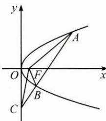

<!-- question-source:start -->
1. 如图, 设抛物线 $y^{2}=4x$ 的焦点为 F, 不经过焦点的直线上有三个不同的点 A, B, C, 其中点 A, B 在抛物线上, 点 C 在 y 轴上, 则 $\triangle BCF$ 与 $\triangle ACF$ 的面积之比是 ( ).
A. $\frac{|BF|-1}{|AF|-1}$ B. $\frac{|BF|^{2}-1}{|AF|^{2}-1}$ C. $\frac{|BF|+1}{|AF|+1}$ D. $\frac{|BF|^{2}+1}{|AF|^{2}+1}$

<!-- question-source:end -->

![[Q00009732A1]]
