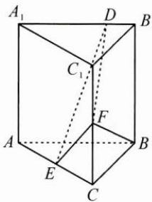

<!-- question-source:start -->
3. 如图, 在直三棱柱 $ABC - A_{1}B_{1}C_{1}$ 中, 侧面 $AA_{1}B_{1}B$ 为正方形, $AB = BC = 2, E, F$ 分别为 $AC, CC_{1}$ 的中点, $D$ 为棱 $A_{1}B_{1}$ 上的点, $BF \perp A_{1}B_{1}$ .

(1) 证明: $BF \perp DE$ ;

(2) 当 $B_{1}D$ 为何值时, 平面 $BB_{1}C_{1}C$ 与平面 DFE 所成的锐二面角的正弦值最小?

<!-- question-source:end -->

![[Q00009734A1]]
