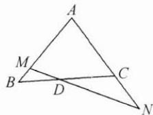

## 典例示范

例 1 已知 $f(x)$ 是一次函数, 且满足 $3f(x+1)-2f(x-1)=2x+17$ , 则 $f(x)=$ \_\_\_\_.

思路 题目给出的已知条件为一次函数, 又已知 $3f(x+1)-2f(x-1)$ 的运算结果式, 可以设一次函数解析式, 将 $f(x+1)$ , $f(x-1)$ 代入解析式后, 利用恒等式解得待定系数的值.

解答 设 $f(x) = ax + b (a \neq 0)$ ,

则 $3f(x + 1) - 2f(x - 1) = 3ax + 3a + 3b - 2ax + 2a - 2b = ax + 5a + b,$

即 $ax+5a+b=2x+17$ 不论 x 为何值都成立，

所以 $\left\{\begin{aligned}a=2,\\ b+5a=17,\end{aligned}\right.$ 解得 $\left\{\begin{aligned}a=2,\\ b=7,\end{aligned}\right.$

所以 $f(x)=2x+7$ .

反思 在遇到求函数解析式的问题时,可以将函数图象的性质、函数关系等与待定系数法相结合,求出函数解析式.

例2 在数列 $\{a_{n}\}$ 中，若 $a_1 = 1, a_{n+1} = 2a_n + 3$ ，则通项公式 $a_{n} =$ \_\_\_\_.

思路 形如 $a_{n+1} = ca_n + d (c \neq 0, 1)$ 的数列，可以运用待定系数法设 $a_{n+1} + \lambda = c(a_n + \lambda)$ ，求出 $\lambda$ 后，化为等比数列，进而求出其通项.

解答 递推公式 $a_{n+1} = 2a_n + 3$ 可以转化为 $a_{n+1} + t = 2(a_n + t)$ ,

即 $a_{n + 1} = 2a_n + t$ ，解得 $t = 3.$ 故 $a_{n + 1} + 3 = 2(a_n + 3).$

令 $b_{n}=a_{n}+3$ ，则 $b_{1}=a_{1}+3=4$ ，且 $\frac{b_{n+1}}{b_{n}}=\frac{a_{n+1}+3}{a_{n}+3}=2$ ，

所以 $\{b_n\}$ 是以4为首项，2为公比的等比数列， $b_{n} = 4\cdot 2^{n - 1} = 2^{n + 1}$

所以 $a_{n}=2^{n+1}-3$ .

反思 递推公式的形式为待定系数法提供了结构的启示,从而构造出形如 $a_{n+1} + t = 2(a_n + t)$ 的目标式.

例 3 已知 $-1 < x + y < 4$ 且 2 < x - y < 3，求 z = 2x - 3y 的取值范围.

思路 已知 $x+y, x-y$ 的取值范围, 根据不等式的运算性质, 把 z=2x-3y 表示为 $x+y, x-y$ 的线性和, 然后对两个不等式 -1<x+y<4, 2<x-y<3 进行运算即可得到 z=2x-3y 的取值范围. 用待定系数法设系数, 使得 $z=2x-3y=(m+n)x+(m-n)y$ , 求得 m, n.

解答 设 $z = 2x - 3y = m(x + y) + n(x - y)$ ，

即 $2x-3y=(m+n)x+(m-n)y,$

所以 $\left\{\begin{aligned}m+n=2,\\ m-n=-3,\end{aligned}\right.$ 解得 $\left\{\begin{aligned}m&=-\frac{1}{2},\\ n&=\frac{5}{2}.\end{aligned}\right.$

由 $-1 < x + y < 4$ 知 $-2 < -\frac{1}{2}(x + y) < \frac{1}{2}$ ①，

由 $2 < x - y < 3$ 知 $5 < \frac{5}{2} (x - y) < \frac{15}{2}$ ②，

①+②得 $3<-\frac{1}{2}(x+y)+\frac{5}{2}(x-y)<8$ ，即 3<z<8.

反思 双变量不等式中系数的确定是解题的关键,合理设置双变量不等式的系数,从而可以运用待定系数法.

例 4 如图, 在 $\triangle ABC$ 中, 点 $D$ 在线段 $BC$ 上, 且满足 $BD = \frac{1}{3} BC$ , 过点 $D$ 的直线分别交直线 $AB$ , $AC$ 于不同的两点 $M, N$ , 若 $\overrightarrow{AM} = m \overrightarrow{AB}, \overrightarrow{AN} = n \overrightarrow{AC}$ , 则 $\frac{2}{m} + \frac{1}{n} =$ \_\_\_\_.

思路 过点 D 的直线分别交直线 AB, AC 于不同的两点 M, N, 点 M, N 位置不确定, 但 M, D, N 三点共线, 可以利用三点共线的结论, 运用待定系数法设基底前的系数, 用相同的基底表达同一个向量, 解方程得到所求值.

解答 因为 M, N, D 三点共线, 所以 $\overrightarrow{AD} = \lambda \overrightarrow{AM} + (1 - \lambda) \overrightarrow{AN}$ ,

又 $\overrightarrow{AM}=m\overrightarrow{AB},\overrightarrow{AN}=n\overrightarrow{AC}$ ，所以 $\overrightarrow{AD}=\lambda m\overrightarrow{AB}+(1-\lambda)n\overrightarrow{AC}$

又 $\overrightarrow{BD} = \frac{1}{3}\overrightarrow{BC}$ ，所以 $\overrightarrow{AD} = \overrightarrow{AB} +\overrightarrow{BD} = \overrightarrow{AB} +\frac{1}{3}\overrightarrow{BC} = \frac{2}{3}\overrightarrow{AB} +\frac{1}{3}\overrightarrow{AC},$

所以 $\lambda m=\frac{2}{3},(1-\lambda)n=\frac{1}{3}$ ，故 $\frac{2}{m}+\frac{1}{n}=3$ .

反思 向量的加减、共线的充要条件、平面向量的基本定理、平面向量的坐标表示、线段的定比分点、线段的平移等内容都涉及待定系数法.

