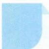

# 19 排除法

# 引路人 浙江省湖州中学 赵朕博

本思想方法涉及模块: 函数、导数、数列、不等式、解析几何、立体几何、三角、向量、概率与统计.

![[高中/思维方法/高中数学思想方法导引2023版/19_排除法/方法介绍/方法介绍.md]]
![[高中/思维方法/高中数学思想方法导引2023版/19_排除法/典例示范/典例示范.md]]
![[高中/思维方法/高中数学思想方法导引2023版/19_排除法/巩固练习/巩固练习.md]]
