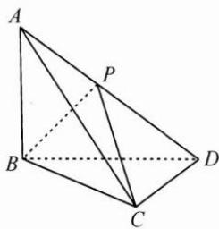

## (一)从条件出发

例 1 如图, 在三棱锥 A-BCD 中, $AB \perp$ 平面 BCD, $BC \perp DC$ , 且 AB = BC = CD, P 为线段 AD 上的动点 (含端点). 设直线 BP 与平面 ABC 所成的角为 $\alpha$ , 二面角 P-BC-D 的平面角为 $\beta$ , 二面角 P-BC-A 的平面角为 $\gamma$ ,

则 $\sin^2\alpha +\sin^2\beta +\sin^2\gamma (\quad)$ A.有最小值 $\frac{3}{2}$ B.有最大值 $\frac{3}{2}$ C.有最小值 $\frac{5}{4}$ D.有最大值 $\frac{5}{4}$

思路 这是立体几何中的动态几何问题, 因为 P 为线段 AD 上的动点, 一般的思路是分析寻找 $\alpha, \beta, \gamma$ 三个角不随点 P 变化的固定关系, 或者设变量把 $\alpha, \beta, \gamma$ 三个角统一代数表示出来. 但在本题中, 可以对点 P 取特殊位置, 利用排除法解决问题.

解答 因为 P 为线段 AD 上的动点（含端点），把点 P 取在点 A 处，则 $\alpha=0^{\circ},\beta=90^{\circ},\gamma=0^{\circ}$ ，所以 $\sin^{2}\alpha+\sin^{2}\beta+\sin^{2}\gamma=1$ ，排除 A,C.

把点 P 取在点 D 处，则直线 BP 与平面 ABC 所成的角 $\alpha$ 即为 $\angle DBC = 45^{\circ}, \beta = 0^{\circ}, \gamma = 90^{\circ}$ ，此时 $\sin^{2}\alpha + \sin^{2}\beta + \sin^{2}\gamma = \frac{3}{2}$ ，排除 D.

故选B.

反思 本题从正面做也不困难,首先可以发现不管点 P 怎么动, $\beta,\gamma$ 是平面 PBC 分直二面角 A-BC-D 的平面角所成的两个角,所以 $\beta$ 与 $\gamma$ 互余,所以 $\sin^{2}\beta+\sin^{2}\gamma=1$ ,从而看线面角 $\alpha$ 就可以了,根据最大角定理,当点 P 与点 D 重合时线面角 $\alpha$ 最大,即 $\sin^{2}\alpha$ 最大.

当然,其中的转化对于一部分同学来说依然具有一定的难度,此时可以看出排除法的优越性.虽然现在越来越多的题目在命题的时候就会注意避免用排除法能轻易解决的情况,但只要是选择题,排除法永远有一席之地.

(二) 从结果出发

例 2 已知数列 $\{a_{n}\}$ 满足 $a_{1}=0, a_{20}=17, (a_{k+1}-a_{k}+2)(a_{m+1}-a_{m}-3)=0 (k, m=1,2,3,\cdots,19, k\neq m)$ ，集合 $A=\{a_{1}, a_{2}, a_{3}, \cdots, a_{20}\}$ ，则集合 A 中元素的最小值可能为（）.
A. -3 B. -4 C. -5 D. -6

思路 由 $(a_{k+1}-a_{k}+2)(a_{m+1}-a_{m}-3)=0(k,m=1,2,3,\cdots,19,k\neq m)$ 得 $a_{k+1}-a_{k}=-2$ 或 $a_{m+1}-a_{m}=3$ ，即数列后一项相对于前一项的变化要么是-2，要么是+3；因为集合 $A=\{a_{1},a_{2},a_{3},\cdots,a_{20}\},a_{1}=0,a_{20}=17$ ，所以一共进行了8次-2，11次+3，而且要保证没有重复的数字出现，数列具体的通项难以得到，可以从写出一些错误示例和正确示例开始思考，例如： $0\rightarrow-2\rightarrow-4\rightarrow-6\rightarrow-3\rightarrow0\rightarrow\cdots$ 是不行的， $0\rightarrow-2\rightarrow1\rightarrow-1\rightarrow2\rightarrow5\rightarrow3\rightarrow6\rightarrow4\rightarrow7\rightarrow10\rightarrow8$ →11→9→12→15→13→16→14→17 是可行的. 这种情况下排除法往往可以发挥很大的作用.

解答 若最小值是-3，则接下来一定是 $-3\rightarrow0$ ，与 $a_{1}=0$ 重复。排除A.

若最小值是-5，则 $\left\{\begin{aligned}&3\rightarrow1\\ &-2\rightarrow1\\ &-2\rightarrow-4\end{aligned}\right.\rightarrow-1\rightarrow-3\rightarrow-5\rightarrow-2\rightarrow1$ ，均有重复，排除C.

若最小值是-6，则 $0\rightarrow-2\rightarrow-4\rightarrow-6\rightarrow-3\rightarrow-5\rightarrow-2$ ，有重复，排除D.

故选B.

反思 对于 B, 也可以正面推出思路中列举的一种可能性, 但从选项切入用排除法, 不需要从 0 开始, 只需要在具体数字附近展开, 分析和思考的量就少了很多, 更容易获得正确答案.

