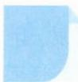

# 20 正难则反

## 方法介绍

正难则反是数学解题的重要方法及技巧. 当一些问题正面解决比较繁杂, 或需要考虑的因素多, 或解题思路不明朗时, 可以考虑其对立面, 即从问题的反面出发破解问题.

![[高中/思维方法/高中数学思想方法导引2023版/20_正难则反/典例示范/典例示范.md]]
![[高中/思维方法/高中数学思想方法导引2023版/20_正难则反/巩固练习/巩固练习.md]]
