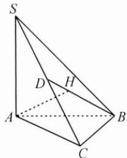

## 典例示范

例1 3位男生和3位女生共6位同学站成一排,若男生甲不站两端,3位女生中有且只有2位女生相邻,则不同排法的种数是( ). A. 360 B. 288 C. 216 D. 96

思路 直接从正面求解不易,故考虑反面情况,先考虑女生满足条件的排法,再减去男生甲不符合条件的排法.

解答 6 位同学站成一排, 3 位女生中有且只有 2 位女生相邻的排法有 $A_{3}^{3}C_{3}^{2}A_{4}^{2}A_{2}^{2}=432$ 种, 其中男生甲站两端的有 $A_{2}^{1}A_{2}^{2}C_{3}^{2}A_{3}^{2}A_{2}^{2}=144$ 种, 符合条件的排法共有 432-144=288 种, 故选 B.

反思 这是有多个限制条件的排列问题,先只考虑女生的限制条件降低难度,再排除男生的限制条件,从而达到目的.

例 2 已知△ABC 为锐角三角形, SA⊥平面 ABC, 点 A 在平面 SBC 内的射影为 H. 求证: H 不是△SBC 的垂心.

思路 否定性的问题,从正面解决比较困难,可以考虑从反面论证.

证明 假设 $H$ 是 $\triangle SBC$ 的垂心.

如图, 连接 BH 并延长, 交 SC 于点 D, 则 BD⊥SC,

由于点 A 在平面 SBC 内的射影为 H，所以 $AH \perp SC$ ，

又 $BD \cap AH = H$ ，所以 $SC \perp$ 平面 $ABH$

又 $AB \subset$ 平面 $ABH$ , 所以 $AB \perp SC$ ,

而 $AB \perp SA, SA \cap SC = S$ ，所以 $AB \perp$ 平面 SAC，

又 $AC \subset$ 平面 $SAC$ , 所以 $AB \perp AC$ , 这与 $\triangle ABC$ 为锐角三角形相矛盾,

所以 H 不是 $\triangle SBC$ 的垂心.

反思 本题涉及的方法是反证法, 反证法是正难则反的重要体现.

例 3 已知函数 $f(x)$ 在区间 $[a,b]$ 上的图象连续， $f(a)<0, f(b)>0$ ，且 $f(x)$ 在 $[a,b]$ 上单调递增，求证： $f(x)$ 在 $(a,b)$ 上有且只有一个零点.

思路 先由函数零点存在性定理判定函数在 $(a, b)$ 上有零点，再用反证法证明零点唯一.

证明 因为 $f(x)$ 在 $[a, b]$ 上的图象连续， $f(a) < 0, f(b) > 0$ ，即 $f(a)f(b) < 0$ ，所以 $f(x)$ 在 $(a, b)$ 上至少存在一个零点.

设零点为 m，则 $f(m)=0$ .

假设 $f(x)$ 在 $(a,b)$ 上还存在另一个零点 n，即 $f(n)=0, n \neq m$ .

若 $n > m$ ，则 $f(n) > f(m)$ ，即 $0 > 0$ ，矛盾；

若 $n < m$ ，则 $f(n) < f(m)$ ，即 $0 < 0$ ，矛盾.

因此假设不正确, 即 $f(x)$ 在 $(a, b)$ 上有且只有一个零点.

反思 涉及否定性、唯一性、至少和至多的问题,经常从反面来考虑,可以使问题变得更简单.

