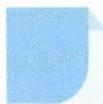

# 21 裂项法

## 方法介绍

裂项法是解决数列求和问题常用的方法,通过分解数列的项,重新组合消去一些项,最终达到化简求和的目的.该方法是分解与组合思想在数列求和中的具体应用.应用裂项法的主要依据为数列通项公式的结构特征,以分式和根式居多,将每一项 $a_{n}$ 拆成形如 $a_{n}=f(n)-f(n-k)(k=1,2,\cdots)$ 的结构,在求和时消去相邻(或相隔)项.换一个角度理解,“裂项”的本质是“通分”的逆变形.裂项法往往与数列不等式、数列放缩相结合,通过把握通项的结构特征找到破解问题的方法.

![[高中/思维方法/高中数学思想方法导引2023版/21_裂项法/典例示范/典例示范.md]]
![[高中/思维方法/高中数学思想方法导引2023版/21_裂项法/巩固练习/巩固练习.md]]
