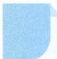

# 22 赋值法

# 引路人 绍兴市第一中学 王一行

本思想方法涉及模块: 函数、三角函数、导数、数列、二项式定理、解析几何等.

![[高中/思维方法/高中数学思想方法导引2023版/22_赋值法/方法介绍/方法介绍.md]]
![[高中/思维方法/高中数学思想方法导引2023版/22_赋值法/典例示范/典例示范.md]]
![[高中/思维方法/高中数学思想方法导引2023版/22_赋值法/巩固练习/巩固练习.md]]
