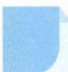

# 23 估算法

引路人 浙江省安吉县昌硕高级中学 刘娇

本思想方法涉及模块: 函数、不等式、解析几何、立体几何、三角函数、概率与统计等.

![[高中/思维方法/高中数学思想方法导引2023版/23_估算法/方法介绍/方法介绍.md]]
![[高中/思维方法/高中数学思想方法导引2023版/23_估算法/典例示范/典例示范.md]]
![[高中/思维方法/高中数学思想方法导引2023版/23_估算法/巩固练习/巩固练习.md]]
