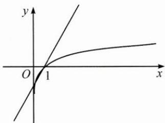
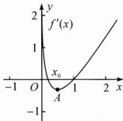

## 典例示范

例1 已知椭圆 $\frac{x^2}{a^2} +\frac{y^2}{b^2} = 1(a > b > 0)$ 的左、右焦点分别是 $F_{1},F_{2}$ ，若椭圆上存在一点 $P$ 使得 $\angle F_1PF_2 = 60^\circ$ ，则椭圆的离心率的取值范围是（ ）.A. $(0,\frac{1}{2} ]$ B. $\left[\frac{1}{2},1\right)$ C. $(0,\frac{\sqrt{3}}{2} ]$ D. $\left[\frac{\sqrt{3}}{2},1\right)$

思路 椭圆是轴对称图形, 点 P 的运动使得 $\angle F_{1}PF_{2}$ 的变化也具有对称性, 因此, 确定好临界状态, 即可根据图象估计离心率的变化.

解答 当点 $P$ 位于短轴端点 $P_{0}$ 处时， $\angle F_{1}P_{0}F_{2}$ 最大，得离心率的边界值 $e = \frac{1}{2}$ ，排除C，D；椭圆越扁， $\angle F_{1}P_{0}F_{2}$ 越大，离心率越大，故选B.

反思 本题考查了椭圆的离心率的求法和运算能力,结合图形推理估计点 P 符合条件的临界位置,简单方便.

例 2 古希腊时期,人们认为最美人体的头顶至肚脐的长度与肚脐至足底的长度之比是 $\frac{\sqrt{5}-1}{2}\left(\frac{\sqrt{5}-1}{2}\approx0.618\right.$ ,称为黄金分割比例),著名的“断臂维纳斯”便是如此(如图).此外,最美人体的头顶至咽喉的长度与咽喉至肚脐的长度之比也是 $\frac{\sqrt{5}-1}{2}$ .若某人满足上述两个黄金分割比例,且腿长为 $105 \mathrm{~cm}$ ,头顶至脖子下端的长度为 $26 \mathrm{~cm}$ ,则其身高可能是( ). A. $165 \mathrm{~cm}$ B. $175 \mathrm{~cm}$ C. $185 \mathrm{~cm}$ D. $190 \mathrm{~cm}$

思路 结合实际情况,由条件中黄金分割比例的定义和数据近似值进行估算.

解答 将头顶至脖子下端的长度 26cm 近似看成头顶至咽喉的长度, 可得咽喉至肚脐的长度小于 $\frac{26}{0.618} \approx 42cm$ ; 再由头顶至肚脐的长度与肚脐至足底的长度之比约是 0.618, 得肚脐至足底的长度小于 $\frac{42 + 26}{0.618} \approx 110cm$ , 从而该人的身高小于 $110 + 42 + 26 = 178cm$ . 由于肚脐至足底的长度大于 105cm, 可得头顶至肚脐的长度大于 $105 \times 0.618 \approx 65cm$ , 从而该人的身高大于 $105 + 65 = 170cm$ . 故选 B.

反思 本题设计数值估算,审题时应明确具体的有效数据,根据黄金分割比例的定义列等式和不等式;列等式时,“头顶至咽喉的长度”由“头顶至脖子下端的长度”来近似估算,“肚脐至足底的长度”由“腿长”近似估算,从而方便解答.

例 3 已知函数 $f(x)=ax^{2}-ax-x\ln x$ ，且 $f(x)\geqslant0$ .

(1) 求 a 的值；

(2) 证明: $f(x)$ 存在唯一的极大值点 $x_0$ , 且 $\frac{1}{\mathrm{e}^2} < x_0 < \frac{1}{\mathrm{e}}$ .

思路 第(1)问,由 x>0 得 $ax-a-\ln x\geqslant0$ , 即 $a(x-1)\geqslant\ln x$ , 由 $x-1\geqslant\ln x$ 可先估计 a=1, 再结合图象验证; 第(2)问, 可以通过二次求导估算 $x_{0}$ 的范围, 进而估算 $f(x_{0})$ 的范围.

解答 (1) $x > 0$ ，则 $ax - a - \ln x \geqslant 0$ ，即 $a(x - 1) \geqslant \ln x$ ，而 $y = x - 1$ 是曲线 $y = \ln x$ 的切线，估计 $a = 1$ .

如图 1, 改变 a 的值, 直线 $y = a(x - 1)$ 的斜率改变, 都不满足题意, 故 a = 1.

(2) $f(x)=x^{2}-x-x\ln x,f^{\prime}(x)=2x-\ln x-2,$

图1

$f''(x)=2-\frac{1}{x}$ ，易知 $f''(x)$ 单调递增， $f''\left(\frac{1}{2}\right)=0,f'\left(\frac{1}{2}\right)<0.$

如图 2, 当 $0 < x < x_{0}$ 时, $f'(x) > 0$ ; 当 $x_{0} < x < 1$ 时, $f'(x) < 0$ ; 当 x > 1 时, $f'(x) > 0$ , 故 $f(x)$ 有唯一的极大值点 $x_{0}$ .

又 $f^{\prime}\left(\frac{1}{\mathrm{e}^{2}}\right) = \frac{2}{\mathrm{e}^{2}} - 2 - \ln \frac{1}{\mathrm{e}^{2}} >0,f^{\prime}\left(\frac{1}{\mathrm{e}}\right) = \frac{2}{\mathrm{e}} - \ln \frac{1}{\mathrm{e}} - 2<$ 0，故 $\frac{1}{\mathrm{e}^2} < x_0 <   \frac{1}{\mathrm{e}}.$

图2
反思 函数题目中的范围估算往往从两方面入手:一是“以直代曲”,寻找曲线的切线;二是估算自变量的范围,结合函数零点存在性定理、极端值或特值点求解.

