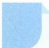

# 24 配凑法

引路人 杭州师范大学附属中学 景芳

本思想方法涉及模块: 函数、导数、数列、不等式、解析几何、三角、向量等.

![[高中/思维方法/高中数学思想方法导引2023版/24_配凑法/方法介绍/方法介绍.md]]
![[高中/思维方法/高中数学思想方法导引2023版/24_配凑法/典例示范/典例示范.md]]
![[高中/思维方法/高中数学思想方法导引2023版/24_配凑法/巩固练习/巩固练习.md]]
