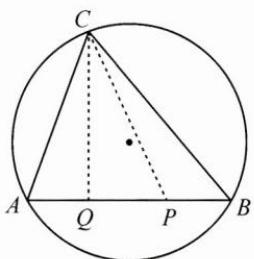
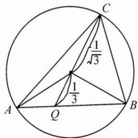

## 典例示范

例1 若 $0 < x < 1$ ，求 $\frac{1}{x} + \frac{2x}{1 - x}$ 的最小值.

思路 注意到分母之和为 1, 可以结合 1 的逆用解决问题.

解答 $\frac{1}{x} +\frac{2x}{1 - x} = \frac{1}{x} +\frac{2}{1 - x} -2 = \left(\frac{1}{x} +\frac{2}{1 - x}\right)(x + 1 - x) - 2 = 1 + \frac{1 - x}{x} +\frac{2x}{1 - x}\geqslant 1 + 2\sqrt{2}$ ，当且仅当 $\frac{1 - x}{x} = \frac{2x}{1 - x}$ 即 $x = \sqrt{2} -1$ 时， $\frac{1}{x} +\frac{2x}{1 - x}$ 取到最小值 $1 + 2\sqrt{2}$

反思 解决该问题,首先需要把分式 $\frac{2x}{1-x}$ 的分子配凑成有关分母1-x的式子,即 $\frac{-2(1-x)+2}{1-x}$ ,从而分离常数,这是处理分式问题的常用策略.

例 2 已知向量 a, b 满足 $\left|2a+3b\right|=1$ ，则 $a \cdot b$ 的最大值为 \_\_\_\_.

思路 解题的关键是结合 $2a + 3b$ 的模长为定值1的条件，把 $\pmb{a}\cdot \pmb{b}$ 配凑成 $2a\cdot 3b$ ，根据数量积运算的极化恒等式，即 $2a\cdot 3b = \frac{(2a + 3b)^2}{4} -$ $\frac{(2a - 3b)^2}{4}$ ，结合 $(2a - 3b)^2\geqslant 0$ 得出最大值.

解答 由极化恒等式可知, $2a\cdot3b=\frac{(2a+3b)^{2}}{4}-\frac{(2a-3b)^{2}}{4}$ ,
因为 $|2a+3b|=1$ ，所以 $2a\cdot3b=\frac{1}{4}-\frac{(2a-3b)^{2}}{4}$ ，因为 $(2a-3b)^{2}\geqslant0$ ，
所以 $2a\cdot3b$ 的最大值为 $\frac{1}{4}$ ，所以 $a\cdot b$ 的最大值为 $\frac{1}{24}$ .

反思 本题通过系数的配凑,使 $a \cdot b$ 转化为已知条件中的 $2a$ 和 $3b$ 的数量积运算,再结合 $|2a + 3b| = 1$ ,选择用极化恒等式计算 $2a \cdot 3b$ .通过对题中的条件和问题进行观察联结,恰当地进行系数、结构的配凑,从而可以直接利用已知条件、已学公式和定理解决问题.

例 3 已知向量 a, b 的夹角为 $60^{\circ}$ ，且 $|a - b| = 1$ ，求 $a \cdot (a + 2b)$ 的最大值.

思路 运用向量的模的运算公式将已知条件转化为 $a^2 - |a||b| + b^2 = 1$ ，根据向量数量积的运算律得 $a \cdot (a + 2b) = a^2 + |a||b|$ . 对于这样的二次双变量问题，通常可以用配凑齐次分式、基本不等式或几何关系等策略解题.

解答 由题意得 $a^2 - |a||b| + b^2 = 1, a \cdot (a + 2b) = a^2 + |a||b|$ .

解法 1: 观察题设和结论, 配凑齐次式.

$$
\boldsymbol {a} \cdot (\boldsymbol {a} + 2 \boldsymbol {b}) = \boldsymbol {a} ^ {2} + | \boldsymbol {a} | | \boldsymbol {b} | = \frac {\boldsymbol {a} ^ {2} + | \boldsymbol {a} | | \boldsymbol {b} |}{1} = \frac {\boldsymbol {a} ^ {2} + | \boldsymbol {a} | | \boldsymbol {b} |}{\boldsymbol {a} ^ {2} - | \boldsymbol {a} | | \boldsymbol {b} | + \boldsymbol {b} ^ {2}},
$$

令 $\frac{|a|}{|b|}=t$ ，则 $a\cdot(a+2b)=1+\frac{2t-1}{t^{2}-t+1}$

令 $2t - 1 = m$ ，则 $\pmb {a}\cdot (\pmb {a} + 2\pmb {b}) = 1 + \frac{m}{\left(\frac{m + 1}{2}\right)^2 - \left(\frac{m + 1}{2}\right) + 1} = 1 + \frac{4m}{m^2 + 3},$

分子、分母同除以 m 配凑基本不等式积为定值的形式，

则 $a \cdot (a + 2b) = 1 + \frac{4}{m + \frac{3}{m}}$ ，显然当 $m > 0$ 时可求得最大值，$m+\frac{3}{m}\geqslant2\sqrt{3}$ ，当且仅当 $\frac{|a|}{|b|}=\frac{\sqrt{3}+1}{2}$ 时， $a\cdot(a+2b)$ 的最大值为 $1+\frac{2\sqrt{3}}{3}$ .
解法 2：设 $|a|=x+y, |b|=x-y$ ,
由 $a^{2}-|a||b|+b^{2}=1$ 得 $x^{2}+3y^{2}=1$ .
因为 $a \cdot (a + 2b) = a^{2} + |a||b| = 2x^{2} + 2xy = 2(x^{2} + xy)$ ,
由 $1=x^{2}+3y^{2}=(1-\lambda)x^{2}+\lambda x^{2}+3y^{2}\geqslant(1-\lambda)x^{2}+2\sqrt{3\lambda}xy$ 根据求解形式，配凑 $1 - \lambda = 2\sqrt{3\lambda}$ ，则 $\lambda = 7 - 4\sqrt{3}$ ，
此时 $1 = x^{2} + 3y^{2} = (1 - \lambda)x^{2} + \lambda x^{2} + 3y^{2} \geqslant (1 - \lambda)(x^{2} + xy)$ ,
所以 $a \cdot (a + 2b) = 2(x^{2} + xy) \leqslant \frac{2}{1 - \lambda} = 1 + \frac{2\sqrt{3}}{3}.$

解法 3: 配凑余弦定理形式.

由 $a^2 - |a||b| + b^2 = 1$ ，构造一个底边长为 1，顶角为 $60^\circ$ 的三角形，如图， $AB = 1, \angle ACB = 60^\circ$ ，

令 $\overrightarrow{CA}=a,\overrightarrow{CB}=b,AP=\frac{2}{3}AB,AQ=\frac{1}{3}AB,$

则 $\boldsymbol{a} \cdot (\boldsymbol{a} + 2\boldsymbol{b}) = 3\boldsymbol{a} \cdot \left( \frac{1}{3}\boldsymbol{a} + \frac{2}{3}\boldsymbol{b} \right) = 3 \overrightarrow{CA} \cdot \overrightarrow{CP} = 3 \overrightarrow{CQ}^{2} - \frac{1}{3} \leqslant 3 \left( \frac{1}{\sqrt{3}} + \frac{1}{3} \right)^{2} - \frac{1}{3} = 1 + \frac{2\sqrt{3}}{3}.$

反思 由解法1不难体会到,当遇到齐次结构时,把问题配凑成齐次分式是解决的有效途径.解法2和解法3分别采用了换元和数形结合的方法,过程中都需要配凑系数和结构,才能成功地使用已知条件.

