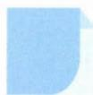

# 26 数形结合

# 引路人 杭州市源清中学 王凯

本思想方法涉及模块: 函数、不等式、向量.

![[高中/思维方法/高中数学思想方法导引2023版/26_数形结合/方法介绍/方法介绍.md]]
![[高中/思维方法/高中数学思想方法导引2023版/26_数形结合/典例示范/典例示范.md]]
![[高中/思维方法/高中数学思想方法导引2023版/26_数形结合/巩固练习/巩固练习.md]]
