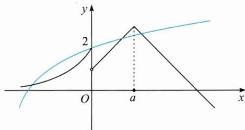
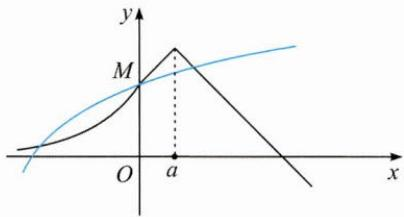
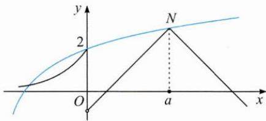
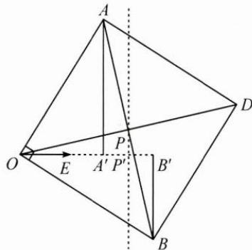

## (一)以形助数,构图看果

例1 已知函数 $f(x) = \begin{cases} 2^{x + 1}, & x \leqslant 0, \\ 3 - |x - a|, & x > 0, \end{cases}$ $g(x) = \log_2(x + 4), h(x) = f(x) - g(x)$ ，若 $h(x)$ 的零点有4个，求实数 $a$ 的取值范围.

思路 如图, 作出 $f(x)$ 的图象(黑线)和 $g(x)$ 的图象(蓝线), 那么问题就是寻求这两个图象有 4 个交点时参数 a 的取值范围.

解答 通过图象可知, $h(x)$ 能否有4个零点取决于x>0时 $f(x)$ 与 $g(x)$ 的图象交点的个数.参数a的作用是控制倒“V”函数的对称轴和最大值,通过移动其图象可以得到两个临界值.当倒“V”函数的图象经过点 $M(0,2)$ 时,a=1(如图1);当倒“V”函数图象的最高点在点 $N(4,3)$ 处时,a=4(如图2).那么实数a的取值范围为(1,4).

图1

图2

反思 要关注代数结构中具有几何意义的数值,用好这些信息,实现“以形助数”.

例 2 已知单位向量 e，平面向量 a, b 满足 $a \cdot e = 2, b \cdot e = 3, a \cdot b = 0$ ，则 $|a - b|$ 的最小值为 \_\_\_\_.

思路 可以通过建系得到代数关系,利用不等式的知识求解,也可以根据条件建构直观图形.

解答 如图, 设 $OE=1, OA'=2, OB'=3$ , 且 $AA'\perp OE, BB'\perp OE$ .

令 $\overrightarrow{OE}=e,\overrightarrow{OA}=a,\overrightarrow{OB}=b.$

因为 $a \cdot b = 0$ ，所以 $a \perp b$ ，那么以 OA 和 OB 为邻边构造矩形 OADB，两对角线的交点为 P，作 $PP' \perp OE$ .

由 P 为 AB 的中点易得 $\left|OP'\right|=2.5$ ,

则 $|a-b|=|\overrightarrow{BA}|=|\overrightarrow{OD}|=2|\overrightarrow{OP}|\geqslant2|\overrightarrow{OP'}|=5,$

故所求最小值为 5.

反思 向量是刻画现实世界中“既有大小又有方向的量”的数学工具,对于向量问题,若能找出代数形式背后的“形”,结合平面几何中的一些基本方法,问题就可以一“望”而解.

