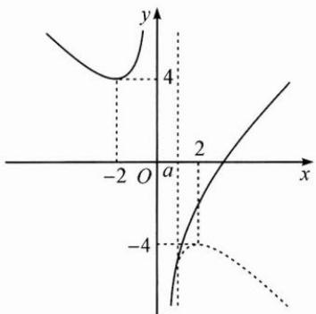
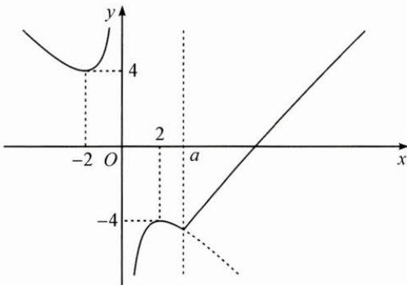
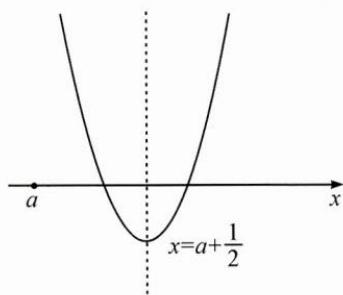
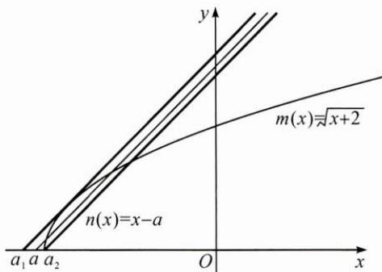

## (二)以数解形,代数寻果

例3 已知函数 $f(x) = \begin{cases} x - \frac{4}{x} - a, & x \geqslant a, \\ a - \left(x + \frac{4}{x}\right), & x < a, \end{cases}$ 若关于 $x$ 的方程 $|f(x)-a|=4$ 恰有四个不同的实数根，求正实数 $a$ 的取值范围.

思路 探求方程 $|f(x) - a| = 4$ 的根的个数，最直观的方式是借助函数图象.

解答 不妨令 $g(x) = f(x) - a$ ，则 $g(x) = \begin{cases} x - \frac{4}{x} - 2a, & x \geqslant a, \\ -\left(x + \frac{4}{x}\right), & x < a. \end{cases}$

$g(x)$ 的图象在 $(-∞,0)$ 上是确定的，在 $(a,+∞)$ 上单调递增，在 $(0,a)$ 上是否单调，取决于 a 和 2 的大小关系，故分为两类，当 $0<a\leqslant2$ 时，如图 1，当 a>2 时，如图 2.

图1

图2

方程 $|f(x)-a|=4$ 的根的个数可转换成函数 $g(x)$ 的图象与直线 $y=\pm4$ 交点的个数，由图易得，当a>2时有四个不同的交点，故 $a\in(2,+\infty)$ .

例 4 如果函数 $f(x)=\sqrt{x+2}+a-x$ 存在两个不同的零点, 求实数 a 的取值范围.

思路 可以用方程观点和函数观点来解决.

解答 解法 1(方程观点):

问题等价于方程 $\sqrt{x + 2} = x - a(x\geqslant a)$ 有两根，

两边平方可得 $x+2=x^{2}-2ax+a^{2}$ .

令 $g(x) = x^{2} - (2a + 1)x + a^{2} - 2$ ，问题转化为函数 $g(x)$ 在 $[a, +\infty)$ 上有两个零点，借助二次函数

图象(如图), 可得 $\left\{\begin{aligned}\Delta&=4a+9>0,\\ a+\frac{1}{2}>a,\\ g(a)&\geqslant0,\end{aligned}\right.$

故 $-\frac{9}{4}<a\leqslant-2.$

解法 2(函数观点):

令 $m(x) = \sqrt{x + 2}$

$$
n (x) = x - a (x \geqslant a)
$$

问题转化为在 $\left[a,+\infty\right)$ 上 $m(x)$ 和 $n(x)$ 的图象有两个交点.

如图, 可得 $a_{\min}=a_{2}=-2$ .

当 $n(x)$ 和 $m(x)$ 的图象相切时，a 接近最大临界值 $a_{1}$ （取不到）.

不妨设切点为 $P(x_0, y_0)$ ，则有 $m'(x_0) = \frac{1}{2\sqrt{x_0 + 2}} = 1$ ，解得 $x_0 = -\frac{7}{4}$ ，代入 $m(x)$ 可得 $y_0 = \frac{1}{2}$ ，即 $P\left(-\frac{7}{4}, \frac{1}{2}\right)$ ，代入 $n(x)$ 可得 $a_1 = -\frac{9}{4}$ .

故 $-\frac{9}{4}<a\leqslant-2.$

反思 对代数结构的不同处理方法,会导致不同的几何表征.本题的两种解法都是利用图象来搭桥,直观地找到问题的解决思路,再利用代数工具进行“精准打击”,获得结果.

