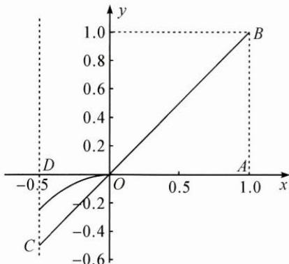

> [!faq]- 巩固练习答案
> **【答案】** 详见解析
>
> **【解析】**
> 设 $g(x)=-x^{2}, x\in\left[-\frac{1}{2},0\right]$ , $h(x)=ax+b,$ 函数 $f(x)=x^{2}+ax+b$ 在 $\left[-\frac{1}{2},0\right]$ 上至少存在一个零点，即 $g(x)$ 和 $h(x)$ 的图象有交点.
> 根据题意可得 $h(1)=a+b\in[0,1]$ ,
> 所求目标 $a-2b=-2h\left(-\frac{1}{2}\right)$ ,
> 如图，当 $h(1)=0$ 且 $h(x)$ 的图象过原点 O
> 时（即直线 AD）， $h\left(-\frac{1}{2}\right)$ 取到最大值 0；
> 当 $h(1)=1$ 且 $h(x)$ 的图象过原点 O 时（即直线 BC）， $h\left(-\frac{1}{2}\right)$ 取到最小值 $-\frac{1}{2}$ .
> 所以 $a - 2b = -2h\left(-\frac{1}{2}\right)\in [0,1].$
> 
