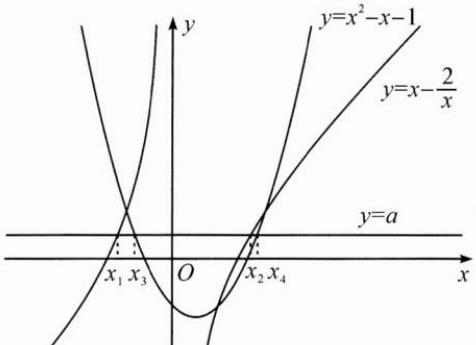
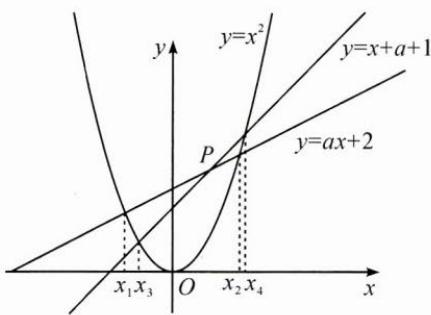
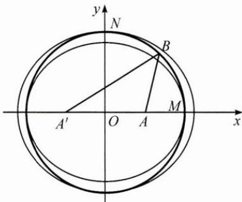

## (一)转换条件

例 1 设关于 x 的方程 $x^{2}-ax-2=0$ 和 $x^{2}-x-1-a=0$ 的实数根分别为 $x_{1}, x_{2}$ 和 $x_{3}, x_{4}$ ，若 $x_{1}<x_{3}<x_{2}<x_{4}$ ，则实数 a 的取值范围为 \_\_\_\_.

思路 本题如果根据条件直接求根,再通过根之间的大小关系解得 a 的取值范围,显然比较麻烦.这种思路易“想”不易“做”,所以要对条件进行转换.

解答 解法1:条件转换为 $x_{1}, x_{2}$ 是函数 $y = x - \frac{2}{x}$ 与 y = a 的图象的两个交点的横坐标, $x_{3}, x_{4}$ 是函数 $y = x^{2} - x - 1$ 与 y = a 的图象的两个交点的横坐标, 数形结合(如图1)易知 -1 < a < 1.

图1

图 2

解法 2: 条件转换为 $x_{1}, x_{2}$ 是抛物线 $y = x^{2}$ 与动直线 $y = ax + 2$ 的两个交点的横坐标, $x_{3}, x_{4}$ 是抛物线 $y = x^{2}$ 与动直线 $y = x + a + 1$ 的两个交点的横坐标, 数形结合(如图 2) 易知 -1 < a < 1.

反思 对于这种构思精巧、条件隐蔽的数学问题,若能见数思形,用图形说话(数形转换),则可使问题简捷获解.

(二)转换结论

例 2 已知向量 a, b 满足 $\left|a\right|=1,\left|b\right|=2$ ，则 $\left|a+b\right|+\left|a-b\right|$ 的最小值是 \_\_\_\_，最大值是 \_\_\_\_。

思路 本题条件简洁,关键是如何转换结论(目标).可以通过引入坐标(或基底),把目标转换为函数最值问题, $|a+b|+|a-b|=\sqrt{5+4\cos\theta}+\sqrt{5-4\cos\theta}$ ,其中 $\theta$ 是向量a,b的夹角;可以转换为线性规划问题;还可以把向量的模看成两点间的距离,把目标转换为一个动点到两个定点的距离之和的最值问题.

解答 解法 1: 设 $\langle a, b \rangle = \theta$ ，则 $|a + b| + |a - b| = \sqrt{5 + 4\cos\theta} + \sqrt{5 - 4\cos\theta}$

$(|a+b|+|a-b|)^{2}=10+2\sqrt{25-16\cos^{2}\theta}$ ，转换为函数最值问题.

易知所求最小值为 4, 最大值为 $2\sqrt{5}$ .

解法2：设 $|\pmb {a} + \pmb {b}| = \sqrt{5 + 4\cos\theta} = x,|\pmb {a} - \pmb {b}| = \sqrt{5 - 4\cos\theta} = y,x,y\geqslant 1,$

则有 $x^{2} + y^{2} = 10$ ，命题转换为已知 $x^{2} + y^{2} = 10(x,y\geqslant 1)$ ，求 $z = x + y$ 的最值.以下略.

解法 3: 设 $a=(1,0)$ ，则 $-a=(-1,0)$ ， $b=(2\cos\alpha,2\sin\alpha)$ ， $A(1,0)$ ， $A'(-1,0)$ ， $B(2\cos\alpha,2\sin\alpha)$ ，所以 $|a+b|+|a-b|=|BA|+|BA'|$ ，点 B 的轨迹是以点 A， $A'$ 为焦点，长轴长为 $|BA|+|BA'|$ 的椭圆.

如图，点 B 也在圆 $x^{2}+y^{2}=4$ 上.

当点 B 经过点 $M(2,0)$ 时，椭圆的长轴长 $\left|BA\right| + \left|BA'\right|$ 的最小值为 4；
当点 B 经过点 $N(0,2)$ 时，椭圆的长轴长 $\left|BA\right| + \left|BA'\right|$ 的最大值为 $2\sqrt{5}$ .

反思 有时换一个视角看问题(视角转换),解答就势如破竹.
