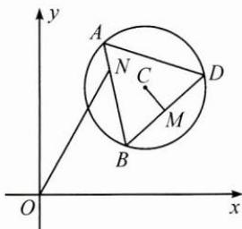

<!-- question-source:start -->
4. 如图, 已知圆 $C: (x - 2)^{2} + (y - 2)^{2} = 1$ , $\triangle ABD$ 为圆 $C$ 的内接正三角形, $M$ 为边 $BD$ 的中点, 当 $\triangle ABD$ 绕圆心 $C$ 转动, 同时点 $N$ 在边 $AB$ 上运动时, $\overrightarrow{ON} \cdot \overrightarrow{CM}$ 的最大值是 \_\_\_\_.

<!-- question-source:end -->

![[Q00009771A1]]
