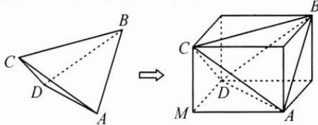

## (二)整体复原

例 3 如图, 在四面体 A-BCD 中, $AB=CD=\sqrt{41}$ , $AC=BD=2\sqrt{13}$ , $AD=BC=\sqrt{61}$ , 则该四面体的外接球半径为 \_\_\_\_.

思路 将四面体 A-BCD 补形, 复原到长方体中, 如图, 则只需要用待定系数法求出长、宽、高, 从而求得外接球半径.

解答 设补形所得长方体的长、宽、高分别为 $x, y, z$ ，则 $\left\{ \begin{array}{l} x^2 + z^2 = 52, \\ x^2 + y^2 = 61, \\ y^2 + z^2 = 41, \end{array} \right.$

解得 $x^{2} + y^{2} + z^{2} = 77 = (2R_{\text{外接球}})^{2}$ ，所以外接球的半径为 $\frac{\sqrt{77}}{2}$ .

反思 将几何体通过割补等方式复原到长方体、正方体中，有助于问题的可视化、便捷化处置，这是运用整体方法解决问题的典型案例.
