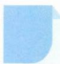

# 29 局部处理

# 引路人 湖州市教科研中心 王勇强

本思想方法涉及模块: 不等式、函数、导数、立体几何等.

![[高中/思维方法/高中数学思想方法导引2023版/29_局部处理/方法介绍/方法介绍.md]]
![[高中/思维方法/高中数学思想方法导引2023版/29_局部处理/典例示范/典例示范.md]]
![[高中/思维方法/高中数学思想方法导引2023版/29_局部处理/巩固练习/巩固练习.md]]
