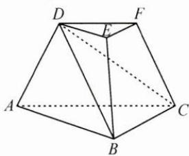
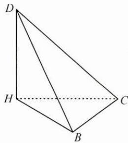

## (一)局部固定法

例 1 已知 a>0, b>0, c>0, $a+b=2$ ，则 $\frac{ac}{b}-\frac{c}{2}+\frac{c}{ab}+\frac{\sqrt{5}}{c-2}$ 的最小值为 \_\_\_\_.

思路 先固定变量 c，将原不等式看成关于变量 a, b 的代数式，求出最小值，再让变量 c 变化，进一步求出原不等式的最小值.

解答 先固定 $c$ ，因为 $a + b = 2, a > 0, b > 0$ ，所以 $\frac{a}{b} + \frac{1}{ab} = \frac{a^2 + 1}{ab} = \frac{a^2 + \left(\frac{a + b}{2}\right)^2}{ab} = \frac{1}{4}\left(\frac{b}{a} + \frac{5a}{b}\right) + \frac{1}{2} \geqslant \frac{1 + \sqrt{5}}{2}$ ，当且仅当 $b = \sqrt{5} a$ 时等号成立.

因此， $\frac{ac}{b} -\frac{c}{2} +\frac{c}{ab} +\frac{\sqrt{5}}{c - 2}\geqslant \frac{1 + \sqrt{5}}{2} c - \frac{c}{2} +\frac{\sqrt{5}}{c - 2} = \frac{\sqrt{5}}{2} (c - 2) + \frac{\sqrt{5}}{c - 2} +\sqrt{5}\geqslant$ $\sqrt{10} +\sqrt{5}$ ，当且仅当 $b = \sqrt{5} a,c = 2 + \sqrt{2}$ 时等号成立，即 $\frac{ac}{b} -\frac{c}{2} +\frac{c}{ab} +\frac{\sqrt{5}}{c - 2}$ 的最小值为 $\sqrt{10} +\sqrt{5}$

反思 本题考查分析问题与解决问题的能力,对逻辑推理能力要求很高.从条件 $a+b=2$ 中发现变量a,b是相互制约的,变量c相对独立,故采用局部固定法,固定变量c,即提取c后进行变形处理,进而得解.

(二)局部突破法

例 2 如图, 在三棱台 DEF-ABC 中, 平面 ADFC⊥平面 ABC, ∠ACB = ∠ACD = 45°, CD = 2BC.

(1) 证明: $EF \perp DB$ ;

(2) 求 DF 与平面 BCD 所成角的正弦值.

思路 分析题意, 可发现三棱台 $DEF-ABC$ 上、下两个底面的对应边互相平行且成比例, 且三组对边的比值相等. 平面 $ADFC \perp$ 平面 $ABC$ , 作 $DH \perp AC$ , 垂足为 $H$ , 则 $DH \perp$ 平面 $ABC$ . 由于该几何体的棱长没有具体数值, $HA$ , $DF$ 的长可变, 且研究发现问题(1)与(2)均与此无关, 所以采用局部突破法, 只需突破该几何体的局部(三棱锥 $D-HBC$ )即可.

解答 (1)作 $DH \perp AC$ 于点 $H$ , 连接 $BH$ .

因为平面 $ADFC \perp$ 平面 ABC，而平面 $ADFC \cap$ 平面 ABC = AC，所以 $DH \perp$ 平面 ABC，从而 $DH \perp BC$ .

因为 $\angle ACB = \angle ACD = 45^{\circ}$ ，所以 $CD = \sqrt{2} CH = 2BC$ ，则 $CH = \sqrt{2} BC.$

取三棱锥 D-HBC, 如图, 在 $\triangle CBH$ 中,

$BH^{2}=CH^{2}+BC^{2}-2CH\cdot BC\cos45^{\circ}=BC^{2}$ ，即 $BH^{2}+BC^{2}=CH^{2}$ ，所以 $BH\perp BC$ .

由棱台的定义可知， $EF \parallel BC$ ，所以 $DH \perp EF, BH \perp EF$ ，

又 $BH \cap DH = H$ ，所以 $EF \perp$ 平面 BHD，而 $DB \subset$ 平面 BHD，所以 $EF \perp DB$ .

(2) 因为 $DF \parallel CH$ , 所以 $DF$ 与平面 $BCD$ 所成角即为 $CH$ 与平面 $BCD$ 所成角.

作 $HG \perp BD$ 于点 G，连接 CG.

由(1)可知, $BC\perp$ 平面BHD,所以平面 $BCD\perp$ 平面BHD,

而平面 $BCD \cap$ 平面 BHD = BD，所以 $HG \perp$ 平面 BCD，

即 $CH$ 在平面 $BCD$ 内的射影为 $CG, \angle HCG$ 即为所求角.

设 BC=a，则 $CH=\sqrt{2}a$ ，

在 Rt△HDB 中， $HG=\frac{BH\cdot DH}{BD}=\frac{\sqrt{2}a\cdot a}{\sqrt{3}a}=\frac{\sqrt{2}}{\sqrt{3}}a$

所以 $\sin\angle HCG=\frac{HG}{CH}=\frac{\sqrt{3}}{3}.$

反思 常规立体几何题的几何体形状是确定的,各个点的位置都能分析出来.然而本题的三棱台形状并不确定,有些点的位置也是变化的,这与常规立体几何认知有冲突,需要通过条件逐步读懂几何体的图形结构,突破局部图形——三棱锥 D-HBC,从而找到合适的解题思路.

例 3 已知 x>0，求证： $\ln x-e^{-x}+\frac{1}{x}>0.$

思路 本题有两个基本思路:一是从整体考虑,研究函数 $f(x)=\ln x-\mathrm{e}^{-x}+\frac{1}{x}$ 的性质,求得该函数的最小值来求证,但是解题过程非常复杂;二是从局部突破,将原问题转化为求证新的不等式 $\ln x+\frac{1}{x}>\mathrm{e}^{-x}$ ,从两个局部函数 $g(x)=\ln x+\frac{1}{x}$ 和 $h(x)=\mathrm{e}^{-x}$ 的性质去分析,通过局部的性质来揭示整体的性态,从而间接破题.

解答 令 $g(x) = \ln x + \frac{1}{x}, h(x) = \mathrm{e}^{-x}$ , 则 $g'(x) = \frac{x - 1}{x^2}$ , 易知 $g(x)$ 在 $(0,1)$ 上单调递减, 在 $(1, +\infty)$ 上单调递增, 所以 $g(x)$ 的最小值为 $g(1) = 1$ . 当 $x > 0$ 时, $h(x) = \mathrm{e}^{-x} < \mathrm{e}^{0} = 1$ .

故当 $x > 0$ 时， $\ln x + \frac{1}{x} >\mathrm{e}^{-x}$ ，不等式 $\ln x - \mathrm{e}^{-x} + \frac{1}{x} >0$ 恒成立.

反思 整体的特性是由各个局部及其相互作用方式决定的,局部总会以一定的形式或在一定程度上反映整体的性质.在解决某些较复杂的数学问题时,应当善于从局部去认识整体,有局部突破意识.

