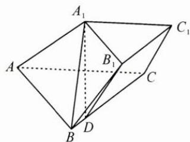

<!-- question-source:start -->
3. 如图, 已知三棱台 $ABC - A_{1}B_{1}C_{1}$ , 二面角 $A_{1} - AC - B$ 的大小为 $60^{\circ}$ , 点 $A_{1}$ 在平面 $ABC$ 内的射影 $D$ 在 $BC$ 上, $AA_{1} = AB = 4$ , $\angle A_{1}AC = 30^{\circ}$ , $\angle BAC = 90^{\circ}$ .

(1) 证明: $AC \perp$ 平面 $A_{1}B_{1}D$ ;

(2)求直线 $A_{1}B$ 与平面 $ACC_{1}A_{1}$ 所成角的正弦值.
<!-- question-source:end -->

![[Q00009777A1]]
