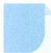

# 30 变量分离法

# 引路人 浙江省兰溪市第一中学 祝玲

本思想方法涉及模块: 函数、导数、不等式等.

![[高中/思维方法/高中数学思想方法导引2023版/30_变量分离法/方法介绍/方法介绍.md]]
![[高中/思维方法/高中数学思想方法导引2023版/30_变量分离法/典例示范/典例示范.md]]
![[高中/思维方法/高中数学思想方法导引2023版/30_变量分离法/巩固练习/巩固练习.md]]
