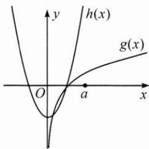
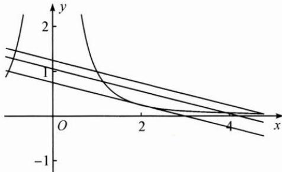

## 典例示范

例 1 已知方程 $\ln|x| - ax^{2} + \frac{3}{2} = 0$ 有 4 个不同的实数根，则实数 a 的取值范围是 \_\_\_\_.

思路 由于方程左边对应的函数是一个偶函数,且 $x \neq 0$ ,于是只要当 $x > 0$ 时,方程 $\ln x - ax^2 + \frac{3}{2} = 0$ 有 2 个不同的实数根即可.

解答 问题等价于当 $x > 0$ 时，方程 $\ln x - ax^2 +\frac{3}{2} = 0$ 有2个不同的实数根.

解法1(不分离): 令 $f(x)=\ln x-ax^{2}+\frac{3}{2}(x>0)$ ,

则 $f'(x)=\frac{1}{x}-2ax=\frac{1-2ax^{2}}{x}.$

①当 $a \leqslant 0$ 时， $f'(x) > 0$ ，故 $f(x)$ 在 $(0, +\infty)$ 上至多有1个零点，不符合题意，舍去.

②当 $a > 0$ 时， $f(x)$ 在 $\left(0, \sqrt{\frac{1}{2a}}\right)$ 上单调递增，在 $\left(\sqrt{\frac{1}{2a}}, +\infty\right)$ 上单调递减，

所以 $f(x)_{\max} = f\left(\sqrt{\frac{1}{2a}}\right) = \ln \sqrt{\frac{1}{2a}} + 1 > 0$ ，解得 $a < \frac{\mathrm{e}^2}{2}$ .

又当 $x \to 0$ 时， $f(x) \to -\infty$ ，当 $x \to +\infty$ 时， $f(x) \to -\infty$

所以，当 $0 < a < \frac{\mathrm{e}^2}{2}$ 时，函数 $f(x)$ 在 $(0, +\infty)$ 上有2个零点，即原方程有4个不同的实数根.

解法 2(全分离): $\ln x - ax^{2} + \frac{3}{2} = 0 \Leftrightarrow \ln x + \frac{3}{2} = ax^{2} \Leftrightarrow a = \frac{\ln x + \frac{3}{2}}{x^{2}}.$

令 $f(x) = \frac{\ln x + \frac{3}{2}}{x^2} (x > 0)$ ，则 $f'(x) = \frac{-2(1 + \ln x)}{x^3}$ ，

易知 $f(x)$ 在 $\left(0, \frac{1}{\mathrm{e}}\right)$ 上单调递增，在 $\left(\frac{1}{\mathrm{e}}, +\infty\right)$ 上单调递减，

所以 $f(x)_{\max}=f\left(\frac{1}{e}\right)=\frac{e^{2}}{2}.$

又当 $x \to 0$ 时， $f(x) \to -\infty$ ，当 $x \to +\infty$ 时， $f(x) \to 0$ ，所以 $0 < a < \frac{e^2}{2}$ .

解法 3(半分离): $\ln x - ax^{2} + \frac{3}{2} = 0 \Leftrightarrow \ln x = ax^{2} - \frac{3}{2}$ .

令 $g(x) = \ln x, h(x) = ax^2 - \frac{3}{2} (x > 0)$ ，如图，显然当 $a \leqslant 0$ 时，两函数图象只有1个交点，不满足题意，故 $a > 0$ 当 $h(x)$ 与 $g(x)$ 的图象相切时是临界情况，此时 $a$ 最大.

设两条曲线相切时切点坐标为 $(x_{0},y_{0})$ ,

则 $\left\{\begin{aligned}\frac{1}{x_{0}}&=2ax_{0},\\ \ln x_{0}&=ax_{0}^{2}-\frac{3}{2},\end{aligned}\right.$ 解得 $\left\{\begin{aligned}x_{0}&=\frac{1}{e},\\ a&=\frac{e^{2}}{2},\end{aligned}\right.$

所以当 $h(x)$ 与 $g(x)$ 的图象有2个交点时， $0 < a < \frac{\mathrm{e}^2}{2}$ .

反思 “分离”较之“不分离”，有效避免了对参数的分类讨论；“半分离”较之“全分离”，又有函数简单、易作图的优点。在处理一个陌生的、复杂的方程时，可以通过等价变换，使等式两边转化成熟悉的、简单的函数，然后结合函数图象快速求解。

例 2 当 $x \in [1,4]$ 时，不等式 $0 \leqslant ax^{3} + bx^{2} + 4a \leqslant 4x^{2}$ 恒成立，则 $a + b$ 的取值范围是 \_\_\_\_.

思路 双参数问题整体处理比较困难,可以尝试对不等式进行巧妙变形,有效分离.

解答 解法 1: 原不等式 $\Leftrightarrow -bx^{2} \leqslant a(x^{3} + 4) \leqslant (4 - b)x^{2}$

$$
\Leftrightarrow - b \leqslant a \left(x + \frac {4}{x ^ {2}}\right) \leqslant 4 - b.
$$

令 $f(x) = x + \frac{4}{x^2}, x \in [1, 4]$ ，则 $f'(x) = \frac{x^3 - 8}{x^3}$ .

易知 $f(x)$ 在 $[1,2]$ 上单调递减，在 $[2,4]$ 上单调递增，

所以在 x=2 处， $f(x)$ 取得极小值 $f(2)=3$ .

又 $f(1) = 5, f(4) = \frac{17}{4}$ , 所以 $f(x) \in [3, 5]$ ,

所以 $\left\{\begin{aligned}a&\geqslant0,\\ -b&\leqslant3a,\\ 5a&\leqslant4-b\end{aligned}\right.$ 或 $\left\{\begin{aligned}a&<0,\\ -b&\leqslant5a,\\ 3a&\leqslant4-b.\end{aligned}\right.$

由 $a + b = 2(3a + b) - (5a + b)$ ，可得 $-4 \leqslant a + b \leqslant 8$ .

解法 2: 原不等式 $\Leftrightarrow -b \leqslant a\left(x + \frac{4}{x^{2}}\right) \leqslant 4 - b.$

①当 $a > 0$ 时，

原不等式 $\Leftrightarrow -\frac{b}{a}\leqslant x + \frac{4}{x^2}\leqslant \frac{4 - b}{a}\Leftrightarrow -\frac{x}{4} -\frac{b}{4a}\leqslant \frac{1}{x^2}\leqslant -\frac{x}{4} -\frac{b - 4}{4a},$

如图,区间端点与切线位置为临界状态,解得 $a+b \geqslant -4$ .

②当 a<0 时，原不等式 $\Leftrightarrow -\frac{x}{4}-\frac{b-4}{4a}\leqslant\frac{1}{x^{2}}\leqslant-\frac{x}{4}-\frac{b}{4a}$ ，同理得 $a+b\leqslant8$ .

③当 a=0 时，原不等式 $\Leftrightarrow -b \leqslant 0 \leqslant 4 - b \Rightarrow 0 \leqslant b \leqslant 4$ ，故 $0 \leqslant a + b \leqslant 4$ .

综上， $-4 \leqslant a + b \leqslant 8.$

反思 解决双参数问题,一般先解决一个参数,再处理另一个参数.解法2通过半分离,将问题转化为一次函数与幂函数的图象之间的位置关系,利用函数的凹凸性作切线,区间端点与切线位置为临界状态.

