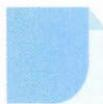

# 31 适度放缩

## 方法介绍

放缩法就是针对目标代数式的结构特征,利用已有不等式的基本性质、函数的单调性及某些代数式的有界性,对目标不等式进行适当放大或缩小的方法.放缩法的主要理论依据是不等关系的传递性与方向的一致性,灵活使用放缩法,可以化繁为简、化难为易.

用放缩法证明不等式,通常要寻找一个中间量,借此来解决问题.放缩法灵活多变、技巧性强,要注意放缩的“尺度”,放得过大或缩得过小,都是不能解决问题的.

![[高中/思维方法/高中数学思想方法导引2023版/31_适度放缩/典例示范/典例示范.md]]
![[高中/思维方法/高中数学思想方法导引2023版/31_适度放缩/巩固练习/巩固练习.md]]
