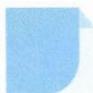

# 33 借助数轴

## 方法介绍

对于单变量范围问题,可借助数轴,用数形结合的方法来直观解决.常见题型有:集合的运算、高次不等式求解(数轴标根法或穿针引线法)、与绝对值有关的解不等式或求最值问题.

![[高中/思维方法/高中数学思想方法导引2023版/33_借助数轴/典例示范/典例示范.md]]
![[高中/思维方法/高中数学思想方法导引2023版/33_借助数轴/巩固练习/巩固练习.md]]
