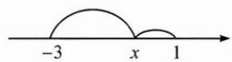

## (三)借助数轴解决绝对值相关问题

例3 求函数 $y = |x - 1| + |x + 3|$ 的最小值.

思路 本题可以分类去绝对值,画出分段函数图象,进而得到最小值,这样计算略复杂.考虑到绝对值的几何意义,可借助数轴直接求解.

解答 $|x - 1| + |x + 3|$ 的几何意义是数轴上的动点 $x$ 到1的距离与到-3的距离之和.

如图, 显然当 $x \in [-3, 1]$ 时, 距离之和最小, 所以函数的最小值为 4.

反思 $|x - a|$ 表示数轴上的实数 $x$ 对应的点与实数 $a$ 对应的点之间的距离，借助这一几何意义可以处理形如 $\sum_{i=1}^{n}|x - x_i|$ 的最小值问题。不妨设 $x_1 \leqslant x_2 \leqslant x_3 \leqslant \cdots \leqslant x_n$ ，若 $n$ 为奇数，则当 $x = x_{\frac{i+1}{2}}$ 时取最小值；若 $n$ 为偶数，则当 $x \in [x_{\frac{i}{2}}, x_{\frac{i}{2}+1}]$ 时取最小值。

