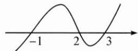

## (二)借助数轴解高次不等式

例2 解不等式: $\frac{x^{2}+2x-2}{3+2x-x^{2}}<x$ .

思路 解分式不等式的步骤为: 移项→通分→分子、分母相除化为相乘. 此时转化为解高次不等式问题, 可利用数轴标根法(穿针引线法)解决.

解答 通过移项、通分,原不等式可化为:

$$
\frac {x ^ {3} - x ^ {2} - x - 2}{- (x ^ {2} - 2 x - 3)} <   0 \Leftrightarrow \frac {(x - 2) (x ^ {2} + x + 1)}{(x - 3) (x + 1)} > 0 \Leftrightarrow \frac {x - 2}{(x - 3) (x + 1)} > 0 \Leftrightarrow (x - 2) (x - 3) (x + 1) > 0.
$$

（分式＞0 的含义是分子与分母同号，而乘积＞0 也表示两部分同号，所以它们是同解变形。）

由数轴标根法得解集为 $x \in (-1, 2) \cup (3, +\infty)$ .

反思 解高次不等式可采用数轴标根法(穿针引线法), 步骤为: 标根 $\rightarrow$ 穿线 $\rightarrow$ 得解. 先把不等式左边因式分解, 如例题中的 $(x - 2)(x - 3)(x + 1)$ , 得到每个因式的零点 $2, 3, -1$ , 并标在数轴上; 这些零点把数轴分成了若干段, 即 $(- \infty, -1), (-1, 2), (2, 3), (3, + \infty)$ , 分析每一段上 $(x - 2)(x - 3)(x + 1)$ 的符号, 并用曲线标在数轴上, 例如 $(-1, 2)$ 上三个因式的符号分别为一、一、十, 相乘为正, 所以引线时线在数轴上方, 表示函数 $y = (x - 2)(x - 3)(x + 1)$ 在 $(-1, 2)$ 上的图象在 $x$ 轴上方. 这样, 每跨过一个零点, 会使一个因式变号, 所以会呈现“穿针引线”的效果. 如果遇到偶次因式, 例如 $(x - 1)^{2}$ , 其零点为 1 , 则在 1 的左右两侧这个因式不变号, 所以有“奇穿偶不穿”的规律.
