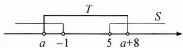

## (一)借助数轴进行集合运算

例 1 设集合 $S = \{ x \mid x < -1 \text{ 或 } x > 5 \} , T = \{ x \mid a < x < a + 8 \} , S \cup T = \mathbf{R}$ ，则 $a$ 的取值范围是 \_\_\_\_.

思路 从容易作图的集合 S 入手, 在数轴上画出 S 的范围, 由于 $S \cup T = R$ , 而数轴上有一部分区域没有被 S 包含, 说明集合 T 负责补 S 空缺的部分.

解答 由图象得 $\left\{\begin{aligned}a&<-1,\\ a&+8&>5,\end{aligned}\right.$ 则 $a\in(-3,-1)$ .

反思 处理集合的交并补运算,数轴是得力的工具.使用时可用不同颜色或不同高度来区分各个集合的区域,用实心点和空心点来区分集合是否包含端点.处理含参数问题时,要检验参数与边界点重合时是否满足题意.
