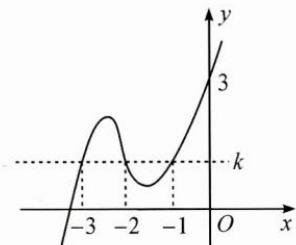

> [!faq]- 巩固练习答案
> **【答案】** C
>
> **【解析】**
> 设 $f(x)=(x+1)(x+2)\cdot(x+3)+k$ ,
> 根据 $f(0)=c$ ，比较常数项可知 k=c-6.
> 画出 $f(x)$ 的大致图象（如图），这里曲线穿过的不是 x 轴，而是直线 $y=f(-1)=k$ ，即图象往上平移了.
> 根据图象有 $0<c-6 \leqslant 3$ ，解得 $6<c \leqslant 9$ 。故选 C.
> 
